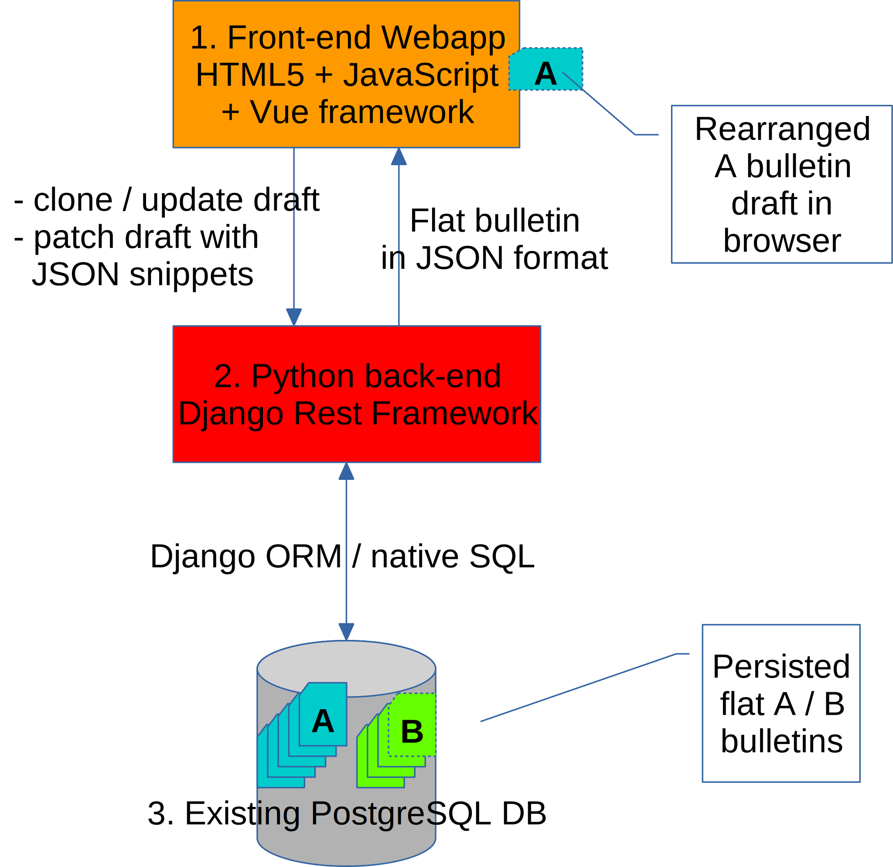

# weboll - Conceptual Description

The architecture is the classical **three-tier** architecture for webapps:



The **front-end** (1) is implemented in HTML5 with:

- the [Bootstrap CSS framework](https://getbootstrap.com/) version 5 (currently in beta)

- the [Babel JavaScript transpiler](https://babeljs.io/) to convert from JavaScript ES6 source code into "compiled" ES5 code that can be grokked by any browser

- and [Vue.js front end JavaScript framework](https://vuejs.org/) version 2.

The **back-end** (2) is implemented in the Python 3.9 language as an "API only" [Django](https://www.djangoproject.com/) project based on [Django REST framework (DRF)](https://www.django-rest-framework.org/); there are no app forms/visual interfaces except the admin interface and the API playground provided by DRF.

The **data-base** (3) reuses the existing PostgreSql database, with minimal changes to the tables as required by Django.

This architecture allows us to get the best out of Django (for the database interface, data types and API structure), while keeping the app UI reactive and fast.

The app can handle any bulletin type, but currently only works for **meteo** and **ozono** bulletins.

## Back-end API

The API for each bulletin is separate, i.e. for Meteo bulletins the routes are in `/api/w05`:

- `/api/w05/bulletins/`: paginated list of bulletins
- `/api/w05/bulletins/<id_w05>`: bulletin details (read-write)
- `/api/w05/svg/<id_w05>`: bulletin in SVG format
- `/api/w05/pdf/<id_w05>`: bulletin in PDF format
- `/api/w05/data/<id_w05_data>`: bulletins data (read-write)
- `/api/w05/sky_conditions/`
- `/api/w05/meteo_classes/`
- `/api/w05/classes/`

and for Ozono Bulletins they are in `/api/w16`:

- `/api/w16/bulletins/`: paginated list of bulletins
- `/api/w16/bulletins/<id_w16>`: bulletin details (read-write)
- `/api/w16/svg/<id_w16>`: bulletin in SVG format
- `/api/w16/pdf/<id_w16>`: bulletin in PDF format
- `/api/w16/data/<id_w16_data>`: bulletin data (read-write)
- `/api/w16/levels/`
- `/api/w16/conf/`

## Bulletin data representations

See details: [Data Models (Italian)](doc/data_models.md)

## Data modification

The draft bulletin is edited by the user via the webapp in the browser.

Each change is applied to the transient, rearranged data representation, but it is also saved as `snapshot` in a Last In First Out (LIFO) data structure (history stack) for Undo and Redo functionality.

Each `snapshot` object contains all the information required to apply or revert a single change to the transient data structure; to do so it contains five fields:

- `id_key` (string): the name of the primary key column in the DB table, i.e. for `w05`: `"id_w05"`, for `w05_data`: `"id_w05_data"`, for `w05_class`: `id_w05_class`; note that since primary key column names are conventionally obtained by prepending the `id_` string to the table name (i.e. `id_` + `w05` = `id_w05`), the primary key column names for main bulletin tables will always be 6-characters long

- `id`: the value of the primary key of the record in the DB table, i.e. for `w05_data`: the `id_w05_data` value

- `value_key`: the name of the column in the DB table that is modified i.e. `situation` in `w05` or `text_value` / `numeric_value` in `w05_data` or `id_ozono_livelli` in `w16_data`

- `old_value`: the old value

- `new_value`: the new value

## Components and unidirectional data flow

To make the webapp JavaScript code well-structured and easy to maintain, we package reusable functionality as [Vue.js **components**](https://v3.vuejs.org/guide/component-basics.html#components-basics), so the app is organized as a tree of nested components:


The concept of **unidirectional data flow** was pioneered by the [React JavaScript library](https://en.wikipedia.org/wiki/React_(JavaScript_library)#Unidirectional_data_flow) but it is also used by the [Vue.js library](hhttps://v3.vuejs.org/guide/component-props.html#one-way-data-flow).

It is best understood by this picture:


This means that a component can not directly change the data: rather it must emit an event which is propagated up the component hierarchical structure and processed by the top-most component (typically a `page`), i.e. the one that "owns" the complete data structure.

When the top-most component has to apply the change to the transient, rearranged data structure, it does so using the `apply` function:

```js
function apply(data, snapshot, reverse=false)
```

The parameters are:

- `data` (input/output, Object): the rearranged transient data structure

- `snapshot` (input): the change to apply / revert

- `reverse` (input, bool): if true, the snapshot is reverted (i.e. the `old_value` is set) else it is applied (i.e. the `new_value` is applied)

The `apply` function looks at the `id_key` string in the `snapshot`. If the `id_key` points to the main `wXY` table, the change is applied / reverted to the root JSON object. If the `id_key` points to one of the `wXY_data` tables, the change is applied / reverted to the record matching the supplied primary key value (the correct record to change is fund by recursively traversing of the hierarchical data structure).

## Data persistence

If the browser tab where the webapp is running is closed, or if the browser app is closed, all unsaved changes are lost.

The user must explicitely press the "Save" button to command the webapp to persist all those transient changes to the DB.

All the change applied to the transient, rearranged data representation, are saved as `snapshot` in the history stack. To persist them to the DB, the stack is first "shaken", removing duplicate changes to the same record in the same table, retaining only the most recent one.

After that a burst of API calls is performed, to a different endpoint for each table:
```
PATCH /api/w16/bulletins/<id_w16>
PATCH /api/w16/data/<id_w16_data>
```
here we use the seldom used [`PATCH` HTTP Request method](https://en.wikipedia.org/wiki/Hypertext_Transfer_Protocol#Request_methods) which is appropriate to apply partial modifications to a resource.

Ideally these changes should be performed with a single API call, but this is pending see #50.
