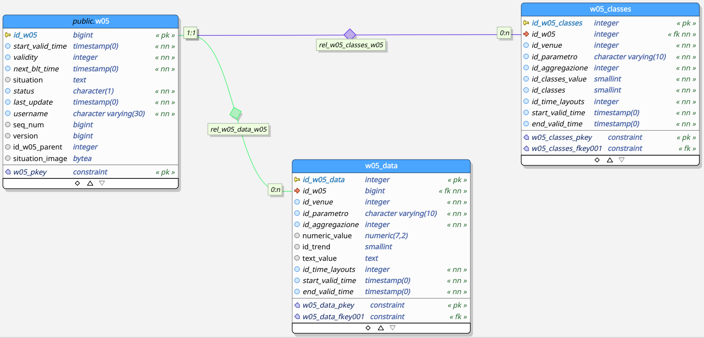
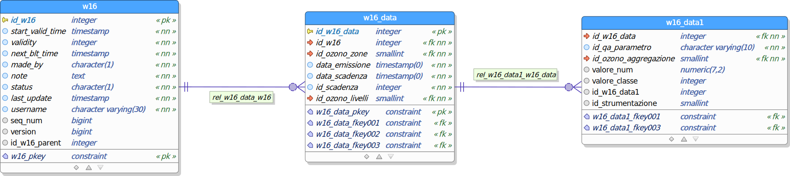

# weboll - Modelli di Dati

[[_TOC_]]

## Introduzione

I dati da gestire per la realizzazione dei bollettini sono:

 - dati `reference`:  possono essere comuni tra diversi bollettini e raramente vengono modificati

 - dati che arrivano **automaticamente** a intervalli prefissati:

   - dati `real time`: raccolti dai sensori e dalle centraline meteorologiche
   - dati `forecast`: calcolati dai modelli matematici meteorologici e QA (qualità dell'aria)

 - dati `products`: controllati ed elaborati degli specialisti tramite l’applicativo **weboll**

I dati vengono resi persistenti in una banca dati sviluppata in ambiente relazionale Postgres, ma devono essere anche trasmessi tra il back-end e il front-end attraverso la RESTful API, e cachati dal front-end nel browser.

La struttura del **database relazionale** deve far fronte sostanzialmente alle seguenti necessità:

 - gestione di una notevole mole di dati
 - ottimizzazione delle prestazioni del sistema rispetto alle interrogazioni principali previste
 - capacità di archiviare dati provenienti da diversi comparti

Per la trasmissione tra il back-end e il front-end si è scelto di **serializzare** i dati nel formato JSON, che rappresenta la _lingua franca_ in ambito front-end ed è più leggero del formato XML.

Infine per visualizzare e modificare i dati nel front-end in certi casi vengono usate delle strutture dati **riarrangiate**, più allineate con l'organizzazione ad oggetti tipica del JavaScript.

## Criteri di conservazione dati

Un bollettino è semplicemente un modo per fissare una certa **situazione** (meteo, ozono, allerta, etc...) a un **determinato momento** (data di emissione) e sotto la responsabilità di un **data persona** (l'autore del bollettino). Sarà quest'ultima a valutare i dati automatici, se necessario elaborarli e trarne delle conclusioni, "inviando" infine il bollettino.

I dati automatici vengono immagazzinati in tabelle `rolling`, in quanto non è necessario che dopo l'eventuale elaborazione questi dati vengano conservati nel database. Le tabelle per tali dati "usa e getta" contengono quindi solo la fotografia più recente dei dati automatici.

I bollettini una volta emessi devono essere invece conservati in maniera permanente insieme a tutti i dati automatici usati dallo specialista per fare le sue valutazioni, questo perché i dati automatici una volta convalidati dallo specialista cambiano di qualità: hanno un valore aggiunto rispetto ai dati "grezzi". Le tabelle `products` servono a questo scopo.

## Dati `reference`

### Dati comuni

#### Anagrafica delle aggregazioni (`AGGREGAZIONE`)

Contiene l’elenco delle aggregazioni.

Colonne:

- `id_aggregazione`: Codice di identificazione della tipologia di aggregazione (chiave primaria)
- `aggregazione`: Descrizione della tipologia di descrizione
- `id_unita_misura`: Codice di identificazione dell’unità di misura (chiave esterna nella tabella `UNITA_MISURA`)
- `tipo_aggregazione`: Tipologia di aggregazione
- `data_agg`: Data ultimo aggiornamento
- `autore_agg`: Autore ultimo aggiornamento

#### Tabella di configurazione dei bollettini (`BOLLETTINI`)

Permette per ogni bollettino di configurare l'invio automatico e in che orario

Colonne:

- `prodotto`: Nome del bollettino (chiave primaria)
- `tabella`: Tabella primaria del bollettino
- `auto`: Invio automatico abilitato (true) o disabilitato (false)
- `time`: Orario di invio automatico in ora locale

#### Anagrafica delle classi previsionali (`CLASSES`)

Contiene l’elenco delle classi previsionali a cui appartengono i parametri. Viene utilizzata per associare uno o più
attributi descrittivi (description) ai parametri meteorologici (`id_parametro`).

Colonne:

- `id_classes`: Codice di identificazione della classe (chiave primaria)
- `id_parametro`: Codice di identificazione del parametro
- `description`: Descrizione della classe
- `last_update`: Data ultimo aggiornamento

#### Anagrafica dei valori delle classi previsionali (`CLASSES_VALUE`)

Contiene l’elenco dei valori possibili per le classi previsionali.

Per ogni classe presente nella tabella CLASSES, fornisce l'elenco dei possibili valori testuali con cui possiamo definire gli attributi meteorologici corrispondenti. Viene utilizzata per alimentare dinamicamente le select dell’interfaccia grafica relative alle singole classi previsionali per ogni parametro meteorologico e per ogni giorno di previsione.

Colonne:

- `id_classes`: Codice di identificazione della classe (chiave esterna nella tabella `CLASSES`)
- `id_classes_value`: Codice di identificazione del valore della classe (chiave primaria)
- `description`: Descrizione della classe
- `last_update`: Data ultimo aggiornamento
- `username`: Autore ultimo aggiornamento

#### Tabella di configurazione del export dei bollettini (`DESTINAZIONI`)

La tabella permette di configurare i vari export per ogni tipologia di Bollettino

Colonne:

- `id_destinazione`: Codice di identificazione della destinazione (chiave primaria)
- `prodotto`: Nome del bollettino
- `destinazione`: Path di output del bollettino può contenere anche destinazioni scp e ftp
- `endpoint`: L'endpoint da chiamare per l'export (pdf/xml/svg)
- `segreto`: Password cryptata
- `enabled`: Export abilitato (true) oppure no (false)

#### Anagrafica dei parametri (`PARAMETRO`)

Contiene l’elenco dei parametri rilevati durante il monitoraggio ambientale.

Colonne:

- `id_parametro`: Codice di identificazione del parametro (chiave primaria)
- `denominazione`: Denominazione del parametro
- `id_unita_misura`: Codice di identificazione dell’unità di misura (chiave esterna nella tabella `UNITA_MISURA`)
- `data_agg`: Data ultimo aggiornamento
- `autore_agg`: Autore ultimo aggiornamento

#### Anagrafica delle condizioni del cielo (`SKY_CONDITION`)

Contiene l’elenco delle tipologie di Sky Condition

Gli id sono maggiori delle tipologie di sky_cond in quanto alcune sono cadute in disuso e il corrispettivo numero non è più utilizzato

Colonne:

- `id_sky_conditon`: Codice numerico di identificazione della Sky Condition (chiave primaria)
- `sky_condition`: Codice alfanumerico di identificazione delle Sky Condition
- `image`: Blob con l'immagine della Sky Condition  (non usato)
- `alt_code`: Alternative text
- `sort_index`: Diverso indice di ordinamento
- `id_infile`: Identificativo output infile
- `last_update`: Data ultimo aggiornamento
- `username`: Autore ultimo aggiornamento

#### Anagrafica delle condizioni del cielo categorizzate con parametri (`SKY_CONDITION_CLASSES`)

Serve per "categorizzare" gli sky condition tramite dei parametri, grazie a questa tabella le icone verranno visualizzate ordinate per parametro

Colonne:

- `id_classes_value`: Codice numerico di identificazione della Classes Value (chiave primaria)
- `id_parametro`: Codice di identificazione del parametro
- `ordinamento`: Codice numerico per l'ordinamento nei combobox delle Sky Condition
- `id_sky_condition`: Codice numerico di identificazione della Sky Condition

#### Anagrafica degli archi temporali (`TIME_LAYOUTS`)

Contiene le informazioni relative agli archi temporali di riferimento.

Questa tabella è collegata a `w05_Data` che a sua volta lo è a `W05`.
Nei bollettini `w05.start_valid_time` e `w05_data.start_valid_time`: il primo dato indica quando è stato validato il bollettino, il secondo indicata la validità all'interno di uno dei campi dello stesso bollettino. Quest'ultimo dato, che insieme a `w05_data.end_valid_time` conclude un arco temporale, è per semplificazione replicato nella tabella `time_layout`, nei campi `start_time` e `end_time`, che sono però solo in formato `time` e non più `date`.

 - (Esempio per `id_time_layouts` = 48)

|time_layouts.id_time_layouts|time_layouts.start_time|time_layouts.end_time|w05_data.start_valid_time|w05_data.end_valid_time|w05.start_valid_time
|:---:|:---:|:---:|:---:|:---:|:---:|
|48|12:00:00|23:59:59|2021-01-01 12:00:00|2021-01-01 23:59:00|2021-01-01 14:00:00|

Colonne:

- `id_time_layouts`: Identificativo progressivo dei record della tabella (chiave primaria)
- `start_day_offset`: Offset rispetto ad oggi
- `end_day_offset`: Fine dell’Offset rispetto ad oggi
- `day_offset`: Non più utilizzata dopo l'introduzione di start_day_offset e end_day_offset
- `start_time`: Inizio range temporale
- `end_time`: Fine range temporale
- `last_update`: Data dell’ultimo aggiornamento
- `username`: Autore dell’ultimo aggiornamento

#### Anagrafica dei trend (`TREND`)

Contiene le informazioni relative ai possibili tipi di trend.

Colonne:

- `id_trend`: Identificativo progressivo dei record della tabella (chiave primaria)
- `id_web`: Diverso ordinamento dei record della tabella valido per la visualizzazione
- `desc_ita`: Descrizione in lingua Italiana
- `desc_eng`: Descrizione in lingua Inglese
- `last_update`: Data dell’ultimo aggiornamento
- `username`: Autore dell’ultimo aggiornamento

#### Anagrafiche delle unità di misura (`UNITA_MISURA`)

Contiene l’elenco delle unità di misura dei parametri

Colonne:

- `id_unita_misura`: Codice di identificazione dell’unita’ di misura (chiave primaria)
- `descrizione`: Descrizione dell'unità di misura
- `last_update`: Data dell’ultimo aggiornamento
- `username`: Autore dell’ultimo aggiornamento

#### Anagrafica delle venues (`VENUE`)

Contiene l’elenco delle località disponibili che variano da punti, città o aree geografiche anche non politiche.

Questa tabella è di riferimento per tutti i bollettini, ma non tutti usufruiscono di tutte le Venues

Colonne:

- `id_venue`: Codice di identificazione della Venue (chiave primaria)
- `altitude`: Quota della Venue
- `last_update`: Data dell’ultimo aggiornamento
- `username`: Autore dell’ultimo aggiornamento

### Bollettino ozono - W16

#### Anagrafica delle aggregazioni dell'ozono (`OZONO_AGGREGAZIONE`)

Contiene l’elenco delle aggregazioni per il bollettino ozono

Colonne:

- `id_ozono_aggregazione`: Identificativo progressivo dei record della tabella (chiave primaria)
- `aggregazione`: Valori possibili dell'aggregazione
- `last_update`: Data dell’ultimo aggiornamento
- `username`: Autore dell’ultimo aggiornamento

#### Anagrafica dei livelli dell'ozono (`OZONO_LIVELLI`)

Contiene livelli, soglie, colori e testi per la compilazione del bollettino ozono

Colonne:

- `id_ozono_livelli`: Identificativo progressivo dei record della tabella (chiave primaria)
- `soglia_inferiore_mxd`: Soglia minima giornaliera del vari livelli di ozono
- `soglia_superiore_mxd`: Soglia massima giornaliera del vari livelli di ozono
- `soglia_inferiore_mx8 `: Soglia minima media mobile giornaliera su otto ore
- `soglia_superiore_mx8 `:  Soglia massima media mobile giornaliera su otto ore
- `riferimento_legge`: Sigla legge relativa a raccomandazioni per la popolazione esposta ad episodi acuti di inquinamento da ozono
- `colore`: Colore relativo al livello
- `rgb`: Codice rgb del colore del livello
- `raccomandazione`: Consigli a seguito dei rischi per livello di ozono
- `last_update`: Data dell’ultimo aggiornamento
- `username`: Autore dell’ultimo aggiornamento

#### Anagrafica delle zone dell'ozono (`OZONO_ZONE`)

Contiene l’elenco delle zone in cui è stato diviso il Piemonte per il bollettino ozono

Colonne:

- `id_ozono_zone`: Identificativo progressivo dei record della tabella (chiave primaria)
- `zone`: Codice corrispondente alle diverse zone
- `last_update`: Data dell’ultimo aggiornamento
- `username`: Autore dell’ultimo aggiornamento

### Bollettino incendi boschivi - W31

#### Anagrafica delle microaree (`W31_MICROAREE`)

Contiene le 47 microaree forestali e per ognuna di esse la denominazione e gli ettari_forestali

Colonne:

- `id_w31_microaree`: Codice numerico di identificazione della microarea (chiave primaria)
- `nome_microarea_forestale`: Denominazione microarea
- `ettari_forestali`: Area boschiva in ettari

#### Anagrafica dei macroaree (`W31_MACROAREE`)

Contiene le 6 macroaree e la loro denominazione

Colonne:

- `id_w31_macroaree`: Codice numerico di identificazione della macroarea (chiave primaria)
- `nome`: Denominazione macroarea

#### Anagrafica dell'aggregazione tra micro a macro aree (`W31_MICRO_MACRO_AREE`)

Contiene le relazioni di appartenneza tra microaree e macroaree

Colonne:

- `id_w31_micro_macro_aree`: Codice numerico di identificazione della'associazione tra micro e macro area (chiave primaria)
- `id_w31_macroaree`: Codice numerico di identificazione della macroarea (chiave esterna nella tabella `W31_MACROAREE`)
- `id_w31_microaree`: Codice numerico di identificazione della microarea (chiave esterna nella tabella `W31_MICROAREE`) 

#### Anagrafica dei giorni (`W31_GIORNI`)

Contiene una serie progressiva di 365 record che indicano i giorni dell'anno, se bisestile per il giorno 366 riusiamo i valori del giorno 365, in quanto hanno stesse soglie.

Colonne:

- `id_w31_giorni`: Numero ascendente che identifica il giorno dell'anno (chiave primaria)

#### Anagrafica dei livelli (`W31_LIVELLI`)

Contiene i 5 livelli di rischio incendo

Colonne:

- `id_w31_livelli`: Numero ascendente che identifica il livello (chiave primaria)
- `colore`: colori associabili ai livelli di rischio

#### Anagrafica dell'aggregazione delle aree, giorni e livelli (`W31_AREE_GIORNI_LIVELLI`)

Contiene l'aggregazione delle tabelle `W31_MICROAREE`, `W31_GIORNI` e `W31_LIVELLI` e la loro soglia superiore dei livelli di rischio

Colonne:

- `id_w31_aree_giorni_livelli`: Codice numerico di identificazione dell'aggregazione tra microarea, giorno e livello (chiave primaria)
- `id_w31_microaree`: Codice numerico di identificazione della microarea (chiave esterna nella tabella `W31_MICROAREE`)
- `id_w31_giorni`: Numero che identifica il giorno dell'anno (chiave esterna nella tabella `W31_GIORNI`)
- `id_w31_livello`: Numero che identifica il livello (chiave esterna nella tabella `W31_LIVELLO`)
- `soglia_superiore`: Valore massimo che può avere l'indice FWI per rientrare nel dato livello

## Dati `rolling`

### Bollettino meteo - W05 (`WEATHER_VALUES`)

La tabella `weather_values` è la tabella rolling per il bollettino meteo

Colonne:

 - `start_time`: Data inizio validità del dato
 - `end_time`: Data fine validità del dato
 - `id_time_layouts`: Codice di identificazione del time layouts
 - `id_parametro`: Codice di identificazione del parametro
 - `id_aggregazione`: Codice di identificazione dell’aggregazione
 - `original_numeric_values`: Valore numerico originale
 - `validated_numeric_values`: Valore numerico validato
 - `original_text_values`: Valore testuale originale
 - `validated_text_values`: Valore testuale validato
 - `original_trend`: Valore trend originale
 - `validated_trend`: Valore trend validato
 - `id_query_numeric`: Id della query
 - `cod_staz_meteo`: Id della query
 - `last_update`: Data dell’ultimo aggiornamento
 - `username`: Autore dell’ultimo aggiornamento

### Bollettino ozono - W16 (`QA_MISURE`)

La tabella `qa_misure` è la tabella rolling per il bollettino ozono

Colonne:

 - `id_qa_misure`: Identificativo progressivo dei record della tabella (chiave primaria)
 - `id_venue`: Codice di identificazione della venue
 - `data_emissisone`: Data di emissione del bollettino
 - `data scandeza`: Data scadenza del bollettino
 - `id_strumentazione`: Fa riferimento a una tabella non ancora utilizzata in Weboll
 - `id_qa_aggregazione`: Identificato del valore dell'aggregazione
 - `id_qa_parametro`: Identificativo del valore del parametro
 - `valore_originale_num`: Valore numerico originale
 - `valore_validato_num`: Valore numerico validato
 - `valore_originale_classe	`: Valore originale della classe
 - `valore_validato_classe`: Valare validato della classe
 - `valore_originale_txt`: Valore testuale originale
 - `valore_validato_txt`: Valore testuale validato
 - `last_update`: Data dell’ultimo aggiornamento
 - `username`: Autore dell’ultimo aggiornamento

### Bollettino incendi boschivi - W31 (`W31_ROLLING`)

La vista `w31_rolling` prende i dati dalla tabella data `w31_input`

Colonne:

- `id`:	Identificativo progressivo dei record della tabella
- `temp`: Valore della temperatura in cradi Celsius
- `umid`: Valore dell'umidità relativà in percentuale
- `velv`: Velore della velocità del vento in metri al secondo
- `prec`: Valore della precipitazione in millimetri
- `id_time_layouts`: Codice di identificazione del time layout (chiave esterna nella tabella `TIME_LAYOUTS`)
- `id_w31_microaree`: Codice numerico di identificazione della microarea (chiave esterna nella tabella `W31_MICROAREE`)

## Dati `product`

Un tipico bollettino viene conservato nel DB in diverse tabelle: la **tabella principale** (con un nome di 3 caratteri come `wXY`) e le **tabelle dati** separate (con nomi più lunghi di 3 caratteri come `wXY_data` / `wXY_data1`).

### Bollettino meteo - W05

L'entity-relationship diagram per le tabelle `product` del bollettino **meteo** è:



#### Tabella principale (`W05`)

Contiene le informazioni relative al prodotto W05 Bollettino Meteorologico: parte fissa.

Colonne:

- `id_w05`: Numero ascendente che identifica il bollettino (chiave primaria)
- `start_valid_time`: Data inizio validità del bollettino
- `validity`: Validità in ore del bollettino
- `next_blt_time`: Data prossima emissione del bollettino
- `situation`: Descrizione testuale della situazione meteorologica
- `status`: Stato del messaggio, 0 = bozza, 1 = inviato
- `last_update`: Data dell’ultimo aggiornamento
- `username`: Autore dell’ultimo aggiornamento
- `seq_num`: Codice identificativo del bollettino utilizzato dall’applicazione **weboll**
- `version`: Progressivo di salvataggio del bollettino utilizzato dall’applicazione **weboll**
- `id_w05_parent`: Se presente identifica il codice univoco del messaggio "padre" (chiave esterna nella tabella `W05`)
- `situation_image`: Blob con l'immagine raster della situazione meteorologica (non usato)

#### Tabella dati per valori (`W05_DATA`)

Contiene le informazioni relative al prodotto W05 Bollettino Meteorologico: parte dinamica legata ai valori previsionali.

Colonne:

- `id_w05_data`: Numero ascendente che identifica il valore previsionale (chiave primaria)
- `id_w05`: Numero ascendente che identifica il bollettino (chiave esterna nella tabella `W05`)
- `id_venue`: Codice di identificazione della Venue (chiave esterna nella tabella `VENUE`)
- `id_parametro`: Codice di identificazione del parametro (chiave esterna nella tabella `PARAMETRO`)
- `id_aggregazione`: Codice di identificazione dell’aggregazione (chiave esterna nella tabella `AGGREGAZIONE`)
- `numeric_value`: Valore numerico del parametro
- `id_trend`: Codice di identificazione del trend (chiave esterna nella tabella `TREND`)
- `text_value`: Valore testuale del parametro
- `id_time_layouts`: Codice di identificazione del time layout (chiave esterna nella tabella `TIME_LAYOUTS`)
- `start_valid_time`: Data inizio validità del dato
- `end_valid_time`: Data fine validità del dato

Normalmente sono uno dei valori possibili (`numeric_value` o `text_value`) valorizzato. Fa accezione solo `id_parametro` = `FRZLVL` (Zero Termico - Freezing Level).

Tuttavia se è valorizzato `numeric_value` in certi casi può essere valorizzato anche `id_trend` (es. per le temperature).

#### Tabella dati per le classi (`W05_CLASSES`)

Contiene le informazioni relative al prodotto W05 Bollettino Meteorologico: parte dinamica legata alle classi previsionali.

Colonne:

- `id_w05_classes`: Numero ascendente che identifica la classe previsionale (chiave primaria)
- `id_w05`: Codice di identificazione del Bollettino (chiave esterna nella tabella `W05`)
- `id_venue`: Codice di identificazione della Venue (chiave esterna nella tabella `VENUE`)
- `id_parametro`: Codice di identificazione del parametro (chiave esterna nella tabella `PARAMETRO`)
- `id_aggregazione`: Codice di identificazione della tipologia di aggregazione (chiave esterna nella tabella `AGGREGAZIONE`)
- `id_classes_value`: Codice di identificazione del valore della classe (chiave esterna nella tabella `CLASSES_VALUE`)
- `id_classes`: Codice di identificazione della classe (chiave esterna nella tabella `CLASSES`)
- `id_time_layouts`: Codice di identificazione del time layout (chiave esterna nella tabella `TIME_LAYOUTS`)


### Bollettino Slops

#### Tabella principale (`W29`)

Contiene le informazioni relative al prodotto W29 Bollettino Slops: parte fissa.

Colonne:

- `id_w29`: Numero ascendente che identifica il bollettino (chiave primaria)
- `data_emissione`: Data di emissione del bollettino
- `ora_emissione`: Ora di emissione del bollettino
- `data_validita`: Data di scadenza della validità del bollettino
- `ora_simulazione`: Ora della simulazione del bollettino
- `data_simulazione`: Data della simulazione del bollettino
- `ora_osservazione`: Ora dei dati osservati del bollettino
- `data_osservazione`: Data dei dati osservati del bollettino
- `numero_bollettino`: identificativo alfanumerico univoco del bollettino
- `situazione_evoluzione`: Eventuale nota testuale
- `note`: Eventuale nota testuale per giustificare le scelte
- `status`: Stato del messaggio, 0 = bozza, 1 = inviato
- `last_update`: Data dell’ultimo aggiornamento
- `username`: Autore dell’ultimo aggiornamento

#### Tabella dati per i valori (`W29_DATA`)

Contiene le informazioni relative al prodotto W29 Bollettino Slops: legata ai valori previsionali per ogni zona di allerta.

Colonne:

- `id_w29_data`: Numero ascendente che identifica il i dati di quella zona (chiave primaria)
- `id_w29`: Numero ascendente che identifica il bollettino (chiave esterna nella tabella `W29`)
- `id_w29_zone`: Identificativo della zona per il bollettino Slops (chiave esterna nella tabella `W29_ZONE`)
- `livello_criticita_oss`: Livello di criticità osservata
- `probabilita_criticita_oss`: Probalità della criticità osservata
- `livello_criticita_prev_oggi`: Livello di criticità prevista di oggi
- `probabilita_criticita_prev_oggi`: Probalità della criticità prevista di oggi
- `livello_criticita_prev_domani`: Livello di criticità prevista di domani
- `probabilita_criticita_prev_domani`: Probalità della criticità prevista di domani

#### Tabella delle zone dello Slops (`W29_ZONE`)

Contiene le informazioni relative alle zone del prodotto W29 Bollettino Slops

Colonne:

- `id_w29_zone`: Numero ascendente che identifica i dati di quella zona (chiave primaria)
- `descrizione`: Descrizione della zona

#### Tabella delle probabilità dello Slops (`W29Probabilita`)

Contiene le informazioni relative alla probabilità del prodotto W29 Bollettino Slops

Colonne:

- `id_w29_probabilita`: caratteri che identificano i dati di quella probabilità (chiave primaria)
- `descrizione`: Descrizione della probabilità

#### Tabella del pericolo dello Slops (`W29Pericolo`)

Contiene le informazioni relative alla probabilità del prodotto W29 Bollettino Slops

Colonne:

- `id_w29_pericolo`: carattere che identifica i dati di quel pericolo (chiave primaria)
- `descrizione`: Descrizione del pericolo

### Bollettino ozono - W16

L'entity-relationship diagram per le tabelle `product` del bollettino **ozono** è:



#### Tabella principale (`W16`)

Contiene le informazioni relative al prodotto W16 Bollettino Ozono: parte fissa.

Colonne:

- `id_w16`: Numero ascendente che identifica il bollettino (chiave primaria)
- `start_valid_time`: Data inizio validità del bollettino
- `validity`: Validità in ore del bollettino
- `next_blt_time`: Data prossima emissione del bollettino
- `made_by`: 0 = Automatic; 1 = Manual
- `note`: Eventuale nota testuale
- `status`: Stato del messaggio, 0 = bozza, 1 = inviato
- `last_update`: Data dell’ultimo aggiornamento
- `username`: Autore dell’ultimo aggiornamento
- `seq_num`: Codice identificativo del bollettino utilizzato dall’applicazione **weboll**
- `version`: Progressivo di salvataggio del bollettino utilizzato dall’applicazione **weboll**
- `id_w16_parent`: Se presente identifica il codice univoco del bollettino "padre"

#### Tabella dati per i valori (`W16_DATA`)

Contiene le informazioni relative al prodotto W16 Bollettino Ozono: parte dinamica legata ai valori previsionali per ogni zona e per ogni scadenza.

Vengono usati `id_scadenza` + `data_scadenza`  come corrispettivo di `time_layout` nel bollettino meteo: ne consegue un più semplice utilizza della tabella a discapito di una duplicazione di records.

Colonne:

- `id_w16_data`: Numero ascendente che identifica il valore previsionale (chiave primaria)
- `id_w16`: Numero ascendente che identifica il bollettino (chiave esterna nella tabella `W16`)
- `id_ozono_zone`: Identificativo della zona per il bollettino ozono (chiave esterna nella tabella `OZONO_ZONE`)
- `data_emissione`: Data di emissione del bollettino (`W16.start_valid_time`) senza l'orario
- `data_scadenza`: Data a cui si riferisce il valore previsionale, valori possibili dal giorno precedente alla data inizio validità del bollettino (`W16.start_valid_time`) fino a tre giorni dopo
- `id_scadenza`: Contatore del giorno, riferito al giorno precedente alla data inizio validità del bollettino (`W16.start_valid_time`), valori possibili: 0, 1, 2 o 3
- `id_ozono_livelli`: Identificativo del livello di allarme per il bollettino ozono (chiave esterna nella tabella `OZONO_LIVELLI`)

#### Tabella dati annidata per i valori (`W16_DATA1`)

Per ogni combinazione di zona e scadenza presente nella tabella `W16_DATA`, contiene i dati misurati o previsti nelle varie modalità di aggregazione spaziale e temporale che sono stati utilizzati dallo specialista per le valutazioni.

Colonne:

- `id_w16_data1`: Numero ascendente che identifica il dato misurato / previsto (chiave primaria)
- `id_w16_data`: Numero ascendente che identifica il valore previsionale (chiave esterna nella tabella `W16_DATA`)
- `id_qa_parametro`: Costante pari a `05`
- `id_ozono_aggregazione`: Identificativo dell'aggregazione per il bollettino ozono (chiave esterna nella tabella `OZONO_AGGREGAZIONI`)
- `valore_num`: Dato misurato / previsto
- `valore_classe`: Campo inutilizzato
- `id_strumentazione`: Fa riferimento a una tabella non ancora utilizzata in Weboll

### Bollettino incendi boschivi - W31

#### Tabella principale (`W31`)

Contiene le informazioni relative al prodotto W31 Bollettino Incedi Boschivi: parte fissa.

Colonne:

- `id_w31`: Numero ascendente che identifica il bollettino (chiave primaria)
- `start_valid_time`: Data inizio validità del bollettino
- `validity`: Validità in ore del bollettino
- `next_blt_time`: Data prossima emissione del bollettino
- `status`: Stato del messaggio, 0 = bozza, 1 = inviato
- `last_update`: Data dell’ultimo aggiornamento
- `username`: Autore dell’ultimo aggiornamento
- `seq_num`: Codice identificativo del bollettino utilizzato dall’applicazione **weboll**
- `version`: Progressivo di salvataggio del bollettino utilizzato dall’applicazione **weboll**
- `algoritmo`: Descrive con quale metodo è stato calcolaro l'indice FWI
- `id_w31_parent`: Se presente identifica il codice univoco del messaggio "padre" (chiave esterna nella tabella `W31`)

#### Tabella dati per i valori (`W31_DATA_MICROAREE_LIVELLI`)

Per ogni bollettino contiene i dati di livello per microarea per time layout oltre ad un colore associato ad un livello di rischio.
Un'ulteriore tabella dati è annidata a questa, la `W31_DATA_MICROAREE_PARAMETRI`.

Colonne:

- `id_w31_data_microaree_livelli`: Codice numerico di identificazione dei dati relativi a microarea e livello (chiave primaria)
- `id_w31`: Numero ascendente che identifica il bollettino (chiave esterna nella tabella `W31`)
- `id_w31_microaree`: Codice numerico di identificazione della microarea (chiave esterna nella tabella `W31_MICROAREE`)
- `id_w31_livelli`: Numero che identifica il livello (chiave esterna nella tabella `W31_LIVELLO`)
- `id_time_layouts`: Codice di identificazione del time layout (chiave esterna nella tabella `TIME_LAYOUTS`)

#### Tabella dati annidata per i valori (`W31_DATA_MICROAREE_PARAMETRI`)

Contiene i dati che definiscono a quale parametro un valore numerico fa riferimento, ed essendo annidata a `W31_DATA_MICROAREE_LIVELLI` si può risalire alla microarea e al livello.

Colonne:

- `id_w31_data_microaree_parametri`: Codice numerico di identificazione dei dati relativi al parametro (chiave primaria)
- `id_w31_data_microaree_livelli`: Codice numerico di identificazione del record relativo alla microarea e al livello (chiave esterna nella tabella `W31_DATA_MICROAREE_LIVELLI`)
- `id_parametro`: Codice di identificazione del parametro (chiave esterna nella tabella `PARAMETRO`)
- `numeric_value`: Valore numerico del dato

#### Tabella dati per i valori (`W31_DATA_MACROAREE_LIVELLI`)

Per ogni bollettino contiene i dati di livello per microarea per time_layout oltre ad un colore associato ad un livello di rischio.
Un'ulteriore tabella dati è annidata a questa, la `W31_DATA_MACROAREE_PARAMETRI`.

Colonne:

- `id_w31_data_macroaree_livelli`: Codice numerico di identificazione dei dati relativi a microarea e livello (chiave primaria)
- `id_w31`: Numero ascendente che identifica il bollettino (chiave esterna nella tabella `W31`)
- `id_w31_macroaree`: Codice numerico di identificazione della macroarea (chiave esterna nella tabella `W31_MACROAREE`)
- `id_w31_livelli`: Numero che identifica il livello (chiave esterna nella tabella `W31_LIVELLO`)
- `id_time_layouts`: Codice di identificazione del time layout (chiave esterna nella tabella `TIME_LAYOUTS`)


#### Tabella dati annidata per i valori (`W31_DATA_MACROAREE_PARAMETRI`)

Contiene i dati che definiscono a quale parametro un valore numerico fa riferimento, ed essendo annidata a `W31_DATA_MACROAREE_LIVELLI` si può risalire alla microarea e al livello.

Colonne:

- `id_w31_data_macroaree_parametri`: Codice numerico di identificazione dei dati relativi al parametro (chiave primaria)
- `id_w31_data_macroaree_livelli`: Codice numerico di identificazione del record relativo alla macroarea e al livello (chiave esterna nella tabella `W31_DATA_MACROAREE_LIVELLI`)
- `id_parametro`: Codice di identificazione del parametro (chiave esterna nella tabella `PARAMETRO`)
- `numeric_value`: Valore numerico del dato

#### Tabella dati per i valori (`W31_INPUT`)

Contiene dati misti sia real time che forecast per le microaree. Gli osservati permangono nella tabella mentre i forecast sono utilizzati dalli vista `W31_ROLLING` per calcolare gli indici FWI dei prossimi giorni e vengono sovrascritti quando il dato diviene osservato. In caso di necessità i dati osservati sono utilizzabili per generare bollettini del passato.

Colonne:

- `id_w31_input`: Codice numerico di identificazione dei dati relativi al record (chiave primaria)
- `id_w31_microaree`: Codice numerico di identificazione della microarea (chiave esterna nella tabella `W31_MICROAREE`)
- `temp`: Valore della temperatura in cradi Celsius
- `umid`: Valore dell'umidità relativà in percentuale
- `velv`: Velore della velocità del vento in metri al secondo
- `prec`: Valore della precipitazione in millimetri
- `data`: Giorno in cui i valori sono osservati o previsti

#### Tabella dati per i valori (`W31_MACROAREE_INPUT`)

Contiene dati misti sia real time che forecast per le macroaree. Stessa struttura della `W31_INPUT` ma questi dati servono per la costruzione della seconda tabella dati del pdf del bollettino e sono salvati per livelli di classe:

- 0 = classe 1 (rh bassa, non disponibile per prec e ws)
- 1 = classe 2 (rh media, ws moderata, prec deboli)
- 2 = classe 3 (rh alta, ws forte, prec moderate)
- per deltat le classi sono -1 (in diminuizione), 0 (stabile) e 2 (in aumento)

Colonne:

- `id_w31_macroaree_input`: Codice numerico di identificazione dei dati relativi al record (chiave primaria)
- `id_w31_macroaree`: Codice numerico di identificazione della macroarea (chiave esterna nella tabella `W31_MACROAREE`)
- `deltat`: Livello per la classe della temperatura
- `rh`: Livello per la classe dell'umidità relativà
- `ws`: Livello per la classe della velocità del vento
- `prec`: Livello per la classe della precipitazione
- `data`: Giorno in cui i valori sono osservati o previsti

## Ulteriori rappresentazioni dei dati dei bollettini

Con Django REST framework e il Django ORM (Object–Relational Mapping) è possibile visualizzare i bollettini dal DB, completi delle tabelle collegate. Ad esempio l'API endpoint `GET /api/ozonos/15858/` restituisce:

```js
{
  "id_w16": 15858,
  "w16data_set": [
    {
      "id_w16_data": 64129,
      "w16data1_set": [
        {
          "id_w16_data1": 853535,
          "id_qa_parametro": "05",
          "valore_num": "70.00",
          "valore_classe": null,
          "id_strumentazione": 2,
          "id_w16_data": 64129,
          "id_ozono_aggregazione": 1
        },
        ...
      ],
      "data_emissione": "2020-11-11T23:00:00+01:00",
      "data_scadenza": "2020-11-13T23:00:00+01:00",
      "id_scadenza": 3,
      "id_w16": 15858,
      "id_ozono_zone": 2,
      "id_ozono_livelli": 4
    },
    ...
  ],
  "start_valid_time": "2020-11-12T00:00:00+01:00",
  "validity": 72,
  "next_blt_time": "2020-11-13T00:00:00+01:00",
  "made_by": "0",
  "note": "NULLA DA SEGNALARE",
  "status": "1",
  "last_update": "2020-11-12T12:30:00.750000+01:00",
  "username": "AUTO",
  "seq_num": 198,
  "version": 0,
  "id_w16_parent": null
}
```

Chiamiamo questa rappresentazione JSON del bollettino **"piatta"** (**"flat"**) perché tutti i dati sono allegati come record alla tabella principale `wXY` (campi `note` e `status`) o memorizzati come parte di un singolo, lungo array di record `wXYdata_set`, in maniera **tabulare** (**table-like**).

L'intero JSON "piatto" del bollettino viene restituito dal back-end quando viene richiesto un bollettino esistente, finalizzato o in bozza, o quando viene richiesta una nuova **"first guess"** per il bollettino di oggi.

Per una più facile visualizzazione il front-end riorganizza il JSON "piatto" ricevuto dal back-end in una struttura gerarchica, dove i record sono raggruppati per `id_time_layout` e `id_parametro` comuni. Per il bollettino meteo, ad esempio, il bollettino riorganizzato ha questa struttura:

```js
{
  "id_w05": 24304,
  "start_valid_time": "2020-11-12T14:00:00+01:00",
  "validity": 84,
  "next_blt_time": "2020-11-13T14:00:00+01:00",
  "situation": "Il nord Italia si trova ... locali nebbie in pianura.",
  "status": "1",
  "last_update": "2020-11-12T12:40:04+01:00",
  "username": "weboll",
  "seq_num": 317,
  "version": 46,
  "id_w05_parent": 24303,
  "w05_data": {
    "48": {
      "WFR": [...],
      "WFOP": [...],
      "VELV": [...],
      "SKY_CONDIT": [
        {
          "id_w05_data": 35,
          "numeric_value": "12.00",
          "text_value": null,
          "start_valid_time": "2020-11-12T07:00:00+01:00",
          "end_valid_time": "2020-11-12T18:59:59+01:00",
          "id_w05": 24304,
          "id_venue": 93,
          "id_parametro": "SKY_CONDIT",
          "id_aggregazione": 914,
          "id_trend": null,
          "id_time_layouts": 48
        },
        ...
      ],
      "FRZLVL": [...],
      "COP_TOT": [...],
      "PLUV": [...]
    },
    "50": {
      "TERMA_700": [...],
      "TERMA": [...],
      "TERMA_1500": [...],
      "TERMA_2000": [...]
    },
    "51": {...},
    "64": {...},
    ...
  }
}
```

In questa struttura dati riorganizzata `w05_data` è un dizionario che ha come chiavi i diversi `time_layout` applicabili (48, 64, 65, 66, 81, 82, 83, 98, 99, 100 e 101). I valori di questo dizionario sono di nuovo dei dizionari, questa volta aventi come chiavi i diversi `parametro` applicabili (`WFR`, `WFOP`, `VELV`, `SKY_CONDIT`, `FRZLVL`, `COP_TOT`, `PLUV`, `TERMA_700`, `TERMA`, `TERMA_1500` e `TERMA_2000`).

Mentre una bozza del bollettino viene modificata da un utente utilizzando il front-end di weboll, questa struttura dati transitoria in memoria mantiene lo stato attuale del bollettino nel browser.

Questo stato della cache deve essere sincronizzato con il database. La sincronizzazione può avvenire:

1. **automaticamente** non appena l'utente conferma ogni cambiamento di campo (ad esempio quando il campo perde il focus), secondo una logica di "salvataggio automatico"

2. quando l'utente richiede esplicitamente l'invio dei dati al back-end cliccando sul pulsante **Salva**.

Nel primo caso il rischio di perdita di dati è minimo, ma non è possibile eseguire l'operazione offline; inoltre per i bollettini complessi in cui diversi campi sono strettamente accoppiati e devono essere salvati atomicamente (ad esempio quando le condizioni del cielo previsto sono cambiate, allora anche il riassunto testuale della situazione dovrebbe essere cambiato) e può portare ad uno stato salvato incoerente (ad esempio se il primo campo è sincronizzato mentre la sincronizzazione del secondo campo fallisce).

Nel secondo caso, poiché sempre più modifiche vengono applicate senza salvare, lo stato memorizzato nella cache del browser può differire significativamente dallo stato persistente nel database, con un aumento del rischio di perdita di dati (ad esempio in caso di crash del browser o del sistema operativo). Qui però il vantaggio è che lo specialista può fare diverse modifiche complesse, annullarle e rifarle, pensarci sopra e poi inviarle atomicamente al server solo quando è soddisfatta al 100%.

## Navigare i database

**pgModeler**

Installare pgModeler tramite

    sudo apt install pgmodeler

Poiché questa stanza è presente nella configurazione del servizio `postgres` in modalità sviluppo (vedi `local.yml` nella chiave postgres):

    ports:
      - "5433:5432"

si stabilisce una connessione tra la porta 5433 dell'host, e la porta di difetto di postgres nel container (5432) che altrimenti sarebbe visibile solo dalla rete interna dei servizi docker.

Per questo motivo dall'host si può entrare nel DB del container dando da terminale:

    psql -p 5433 -h localhost -U weboll core

e per stabilire la connessione in pgModeler:

 - host = localhost
 - port = 5433
 - user = weboll
 - pass = weboll

**Adminer**

Poiché il servizio `adminer` è presente nella configurazione in modalità sviluppo (vedi `local.yml`) si può navigare il database al link http://localhost:8090/?pgsql=postgres&username=weboll&db=core&ns=public ( pass = weboll ).
