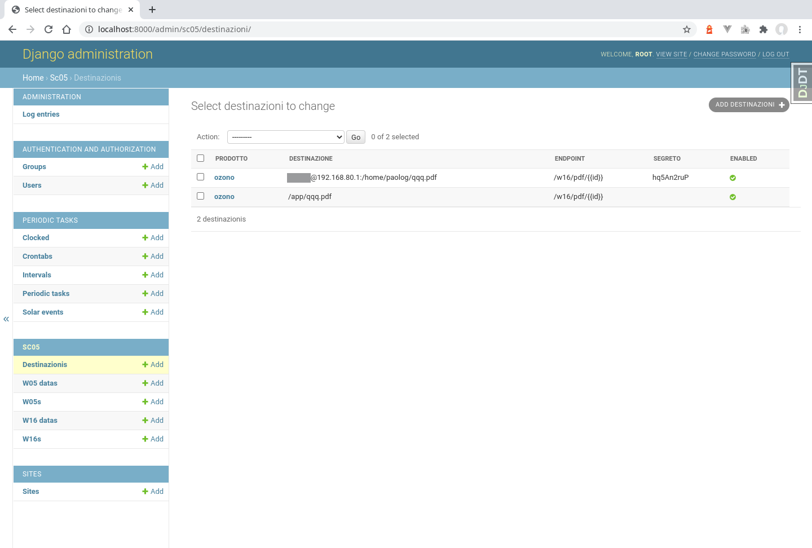

# weboll - Manuale dell'amministratore

Questo documento spiega le procedure che devono essere seguite per gestire amministrativamente weboll.

Prerequisiti:

- Bisogna avere accesso a weboll in produzione con un ruolo `superuser` o `staff` per poter accedere alla sezione "Django administration" dell'applicativo: https://production.example.com:8000/admin/

- Bisogna poter accedere con `ssh` a production.example.com con privilegi sudo per effettuare certe operazioni alla linea di comando.

# Gestione Utenti

Gli utenti **non privilegiati** vengono creati automaticamente quando viene effettuato il primo accesso con credenziali Active Directory.

È possibile anche creare utenti non-Active Directory, che usano una password specifica per Django - questi utenti potranno accedere anche se il server Active Directory fosse inattivo o irraggiungibile.

Per creare un utente non-Active Directory **non privilegiato** si accede alla shell Django:

```sh
ssh production.example.com
cd /srv/weboll
docker-compose -f local.yml exec celerybeat python3 manage.py shell
```

e quindi al prompt Python:

```py
from django.contrib.auth.models import User
user = User.objects.create_user('auto', 'auto@example.com', 'auto')
user.save()
^d
```

Per creare un utente non-Active Directory **privilegiato** ("superuser"):

```sh
ssh production.example.com
cd /srv/weboll
docker-compose exec django python3 manage.py createsuperuser
```

La gestione utenti avviene dalla pagina: https://production.example.com:8000/admin/auth/user/:


Da qui è possibile:

1. Rendere certi utenti non privilegiati membri dello `staff`

1. Creare gruppi di utenti

1. Assegnare gli utenti ai gruppi

# Log

Gli eventi più rilevanti vengono registrati nel database, e sono consultabili da https://production.example.com:8000/admin/admin/logentry/:


Per un log più dettagliato accedere al server e visualizzare il log di nginx:

```sh
ssh username@production.example.com
sudo su -
tail -f /var/log/nginx/access.log
```

e quello di `docker-compose`:

```sh
journalctl -xeu weboll.service
```

# Destinazioni

L'invio automatico dei bollettini alle varie destinazioni viene configurato da https://production.example.com:8000/admin/core/destinazioni/:



I campi sono:

1. `prodotto`: al momento può valere `meteo` oppure `ozono`

1. `endpoint`: l'endpoint da cui deve essere scaricato il file, indicato come un percorso relativo dalla root dell'API ma senza il prefisso `/api`, e usando il placeholder `{{id}}` (senza spazi) per l'id del bollettino da scaricare; ad esempio se `endpoint` è `/w16/pdf/{{id}}`, e id = 16566 verrà scaricato: https://production.example.com/api/w16/pdf/16566

1. `destinazione`: il path comprensivo di filename dove deve esser scritto l'output dell'endpoint

  - se comincia con `/` viene scritto sul **filesystem** (in questo caso il campo `segreto` non viene utilizzato e può essere blank)

  - se ha la struttura `username@host:/path/to` verrà copiato col protocollo **scp** usando la password utente salvata nella colonna `segreto`, è possibile anche impostare delle opzioni ssh nei seguenti formati:
    - `username@host:/path/to#KexAlgorithms=+diffie-hellman-group1-sha1/HostKeyAlgorithms=+ssh-dss/Ciphers=+aes256-cbc`
    - `username@host:/path/to#HostKeyAlgorithms=+ssh-dss`
    - `username@host:/path/to`

  - se ha la struttura `ftp://username@host/path/to` verrà copiato col protocollo **ftp** usando la password utente salvata nella colonna `segreto`
  
  - se ha la struttura `mail://user@example.com/file_attach_name/subject/body` verrà spedito come `file_attach_name` via mail

  su questa stringa oltre al placeholder `{{id}}` è possibile anche usare i placeholders `{{year}}`, `{{month}}`, `{{day}}` e `{{time}}` (senza spazi) per cambiare il nome del file di destinazione in base alla data odierna, time aggiungerà ora minuti e secondi (se ad esempio il pdf deve essere esportato più volte al giorno); ad esempio se `destinazione` è `/mnt/h/meteo_{{year}}{{month}}{{day}}.pdf`, il file verrà salvato in `/mnt/h/meteo_20211007.pdf`

1. `segreto` la password utente se `destinazione` è è scp o ftp, oppure lasciare blank

1. `enabled`: campo booleano per attivare (valore di difetto) o disattivare l'invio

1. `auto`: campo booleano per attivare o disattivare (valore di difetto) l'invio automatico con il task `auto_send_last_one` serve per ripetere l'invio ad un determinato orario prestabilito.

I task vengono eseguiti in maniera asincrona dal docker container `celeryworker` quindi il docker-compose di produzione deve essere configurato in modo da montare in questo container i volumi necessari, e con la [rete configurata](https://docs.docker.com/compose/networking/) in modo che possa accedere ai server a cui deve connettersi con `scp`.

Per monitorare l'esecuzione asincrona dei task accedere al dashboard di monitoraggio code https://production.example.com:5555/ con le credenziali:

- username: `fkdFOaHnHdPBuunlggcTZmrkePnGbXDN`
- password: `KYfpK2XBJsUa3YmzbGw9dBVFDQ1kECAXAcZmaH6K2SpMxjywjGZF6HVRkubY1mkw`

La dashboard è basata su [Flower](https://flower.readthedocs.io/en/latest/):


In caso di errore i task vengono marcati come "FAILED" e nei log di `docker-compose` si trova la diagnostica di dettaglio, es. errore nell'endpoint:

```
celeryworker    | [2021-08-14 07:07:16,504: ERROR/ForkPoolWorker-1] Task website.common.tasks.send_bulletin_to_file[56c62089-08bd-46e9-afa2-cb89e73348c2] raised unexpected: HTTPError('404 Client Error: Not Found for url: http://django:8000/w16/pdfa/1')
...
celeryworker    | requests.exceptions.HTTPError: 404 Client Error: Not Found for url: http://django:8000/w16/pdfa/1
```

oppure errore `scp`:

```
celeryworker    | ssh: connect to host 192.168.80.1 port 22: Connection refused
celeryworker    | lost connection
celeryworker    | [2021-08-14 07:07:17,007: ERROR/ForkPoolWorker-8] Task website.common.tasks.send_bulletin_with_scp[dd23db71-13ec-4bf4-b62e-efd2775218af] raised unexpected: TaskFailure('scp failed with code: 1')
```

Per rilanciare un invio:

```sh
docker-compose exec django python3 manage.py shell
from website.common.tasks import send_with_celery
send_with_celery("ozono", 1)  # dove 1 è id_w16
```

# Bollettini automatici

Se necessario, è possibile impostare dei bollettini automatici entro una data ora (diversa per ogni bollettino).

Occorre creare un crontab `* * * * *` (che gira ogni minuto) qui: https://production.example.com:8000/admin/django_celery_beat/crontabschedule/:


Quindi si crea **un solo** periodic task, che lancia il task `website.common.tasks.auto_create_and_send`, legato al crontab di cui sopra qui: https://production.example.com:8000/admin/django_celery_beat/periodictask/:


I bollettini automatici risulteranno inviati dall'utente non-Active Directory non privilegiato **auto**, che va creato (vedi capitolo "Gestione utenti"). La sua password deve essere passata al servizio `celeryworker` impostando la variabile d'ambiente `AUTO_PASSWORD`.

A questo punto per i bollettini automatici basta impostare l'ora di invio (campo **Time**) e il campo **Auto** a **true** qui: https://production.example.com:8000/admin/core/bulletins/, ad esempio in questo modo solo il bollettino ozono sarà inviato automaticamente, alle 12:30, se non esistono per quell'ora dei bollettini ozono per il giorno corrente in stato "Inviato":


Naturalmente ciò richiede che sia implementata una first guess completa del bollettino in oggetto!
