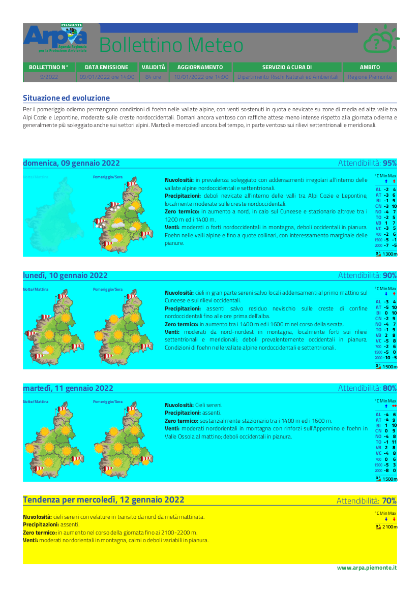

# Guida e consigli per l'export PDF dei bollettini

## Struttura

Ad ora il bollettino meteo (il più consistente e quindi elaborato) ha una struttura modulare molto simile a quella dei componenti Vue: in un file principale, in questo caso `meteo.svg`, vengono importati i diversi **snippet**:

- `header.svg` (grigio) per la testata (che è in `website/templates` perché è comune anche al pdf del bollettino ozono e parametrizzata)
- `meteo_giornata.svg` (azzurro) che con un ciclo `for` itera sui dati del meteo per le prime 3 giornate di previsioni
- e `meteo_tendenza.svg` (giallo) che chiude la pagina e il PDF.



Questi template SVG sono al momento propri dei bollettini meteo e ozono e possono essere modificati o sostituiti nel caso nuovi bollettini lo richiedessero. 

Dentro questi snippet o nel file principale possono comparire delle variabili Python passate nel contesto (`context`) dalla vista `XxxSvgView(TemplateView)`, usando la sintassi delle doppie parentesi graffe (_double curly braces_ `{{ ... }}` anche chiamate scherzosamente _moustaches_ = "baffi"), con le limitazioni del [motore di templates di Django](https://docs.djangoproject.com/en/4.0/topics/templates/). La cosa da ricordare è che:

> Dictionary lookup, attribute lookup and list-index lookups are implemented with a dot notation

quindi invece di `{{ meteo[48].FRZLVL[0]['numeric_value'] }}` come d'uso in altri motori di templating, bisogna scrivere `{{ meteo.48.FRZLVL.0.numeric_value }}`.

## Perché il formato SVG

A differenza di formati [_reflowable_](https://en.wikipedia.org/wiki/Reflowable_document) come l'HTML, l'SVG permette di essere più precisi nel posizionamento dei blocchi utilizzando le coordinate cartesiane che fissano i contenuti.

Rimane però l'esigenza di usare certi elementi HTML nell'SVG: servendoci del [tag `foreignobject`](https://developer.mozilla.org/en-US/docs/Web/SVG/Element/foreignObject) possiamo inserire dei `div` e tutto ciò che ne consegue, ad esempio nel bollettino meteo è stato necessario per giustificare i testi.

## Modifiche grafiche

Finché bisogna realizzare degli interventi semplici o poco impattanti si può modificare direttamente l'SVG, invece per ritocchi consistenti conviene usare programmi per l'editing di SVG.

In questo caso conviene generare un SVG dall'endpoint dedicato, salvarlo e girarlo al grafico/addetto che ci può lavorare con Inkscape o Adobe Illustrator, assicurandosi però che durante il salvataggio non si aumenti troppo la dimensione dell'SVG dato che i programmi di editing inseriscono infomazioni aggiuntive (metadati); ciò è arginabile salvando il file (su Inkscape) nel formato `svg puro`. Con un po' di fortuna l'SVG così ottenuto si potrà diffare con i gli snippet ... 

Per debuggare ed evidenziare la posizione e lo spazio occupato dagli elementi grafici si può utilizzare una classe CSS custom all'interno di `<style>`, es:

```css
.gray {
  fill: gray;
  background-color: gray;
}
```
e applicarla ai `div` dentro ai `foreignobject` oppure a dei `rect` temporanei, es:

```svg
<rect
  class="gray"
  width="190"
  height="30"
  x="10"
  y="10" />
```

## Confronto tra diversi risultati finali

Sull'applicativo la conversione da SVG a PDF viene fatta da `wkhmtltopdf` che si comporta come se aprisse il file sul browser Chrome e poi lo stampasse su PDF. Questo si può replicare anche in locale (o su dentro ai container docker) con il comando `wkhtmltopdf <path>` ma bisogna accertarsi di avere i corretti font (quelli dichiarati negli argomenti dell'SVG) installati nel container o sulla macchina che si sta utilizzando.

L'SVG si può anche aprire in locale direttamente su Chrome e da lì esportarlo a PDF. Oppure con Inkscape e da lì esportarlo a PDF o a PNG.

Ma abbiamo constatato la varie procedure di conversione a PDF o PNG risultano in margini e proporzioni diverse da quelli "in produzione" con `wkhtmltopdf`. Per rilevare in modo accurato le modifiche al prodotto finale i confronti vanno fatti tra files **ottenuti tramite la stessa procedura**. Ad esempio due file creati con Inkscape o due con `wkhmtltopdf`.

Per il confronto dei PDF abbiamo usato `diffpdf`, per quello di PNG abbiamo esportato i file da Inkscape e li abbiamo caricati su `GIMP` aprendoli come livelli (as layers) ovvero sovrapposti e cambiandone poi l'opacità si possono vedere in trasparenza i livelli sottostanti.

In alternativa Gimp può aprire direttamente anche i PDF, facendolo chiederà con che risoluzione si vogliono convertire da vettoriale (PDF) a raster (PNG), generalmente noi usiamo 300 DPI (dots per inch).
