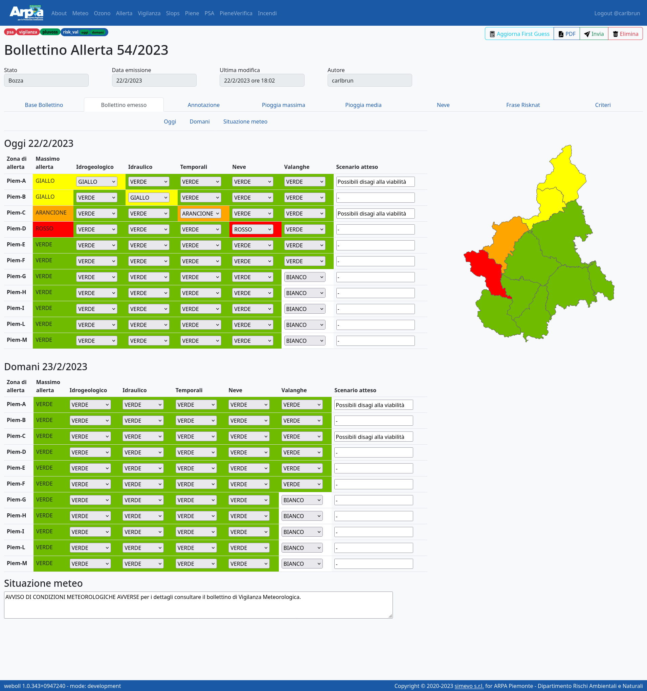

# Guida introduttiva e schematica a Weboll per l'utente

Weboll è l'applicativo di back-office per la produzione di bollettini previsionali ricompresi nelle attività operative istituzionali del Dipartimento Rischi Ambientali e Naturali di Arpa Piemonte.


## Informazioni generali per tutti i bollettini

Senza log-in su Weboll si può:

- Visionare le liste dei bollettini e riordinarli per mese e anno
- Entrare nel dettaglio di un bollettino, anche ancora in bozza
- Scaricare il pdf di un bollettino

Una volta eseguito il log-in si sbloccano più funzionalità, descritte nel seguito per ogni specifico bollettino.

## Bollettino Meteo - W05

### Lista bollettini


**Informazioni della lista dei bollettini meteo w05**

 - `Id`: Numero univoco identificativo del bollettino
 - `Seq`: Numero identificativo del bollettino nell'anno corrente
 - `Data di emissione`: Data creazione bollettino
 - `Data ultima modifica`: Data modifica più recente
 - `Autore`: Chi ha creato il bollettino
 - `Stato`: 3 diverse condizioni del bollettino
    - `Bozza`: Creato ma non ancora inviato
    - `Inviato`: Salvato e inviato, non più modificabile
    - `Riaperto`: Non più inviato e copiato in una nuova bozza modificabile

**Tasti della lista dei bollettini meteo w05**

- `Visualizza`: Chiunque può eseguirla, apre il dettaglio del bollettino
- `PDF`: Chiunque può eseguirla, scarica il pdf del bollettino
- `Elimina`: Necessita il log-in, permette di cancellare il bollettino solo se è odierno, in bozza, ed è l'autore dell'ultima modifica a compiere l'azione
- `Crea bollettino`: Necessita il log-in, compare solo se nella lista dei bollettini non è presente il bollettino odierno, anche solo in bozza e al click porta al dettaglio del bollettino

### Dettaglio bollettino

La pagina di dettaglio è divisa in quattro tab per il giorno di emissione (solo pomeriggio) e i tre giorni successivi.


All'interno di ogni tab le informazioni sono raggruppate in sei sezioni:

1. Sky Condition
1. Nuvolosità
1. Precipitazioni
1. Zero Termico
1. Venti
1. Altri Fenomeni

È possibile passare da una sezione all'altra scorrendo verticalmente, oppure con PGUP / PGDW, oppure cliccando sulle intestazioni, che rimangono sempre visibili quando si scorre.

Scorrendo le sezioni all'interno di ciascun tab rimane inoltre sempre visibile a destra una mappa del Piemonte per il giorno attivo, con le icone correntemente impostate. Nel caso dei giorni successivi al primo è possibile commutare tra la vista delle icone del mattino e del pomeriggio cliccando sul bottone sotto alla mappa.

**Tasti del dettaglio del bollettino meteo w05**

 - `PDF`: Chiunque può eseguirla, scarica il pdf del bollettino

Una volta effettuato il log-in, nel dettaglio del bollettino in bozza compaiono i seguenti tasti:

 - `Ricarica TERMA`: Aggiorna le temperature ai dati più recenti del multi-model
 - `Invia`: Quando il bollettino è compilato in tutti i campi obbligatori e salvato il tasto si attiva e invia il bollettino, cambiandone lo stato
 - `Elimina`: Permette di cancellare il bollettino solo se è quello odierno, è in stato di bozza e l'autore compie l'azione
 - `Undo`: Annulla l'ultima modifica
 - `Redo`: Annulla l'ultimo Undo
 - `Save`: Salva il bollettino

Una volta effettuato il log-in, nel dettaglio del bollettino odierno inviato compaiono i seguenti tasti:

 - `Riapri`: Cambia lo stato da inviato a `Riaperto` e crea una bozza modificabile che è una copia del bollettino riaperto con `Id` e `Seq` aumentati di 1 e stessa `Data di emissione`
 - `Ripeti invio`: Ripete l'invio

### Redazione del bollettino odierno

Il lavoro inizia dalla pagina "Lista bollettini", cliccando sul bottone `Crea bollettino`. Questo comando crea un nuovo bollettino in data odierna con stato `Bozza` e con `Id` e `Seq` aumentati di 1. La first-guess carica le temperature e le icone dal multi-model. La situazione meteo e gli altri campi testuali vengono mutuati dal bollettino precedente. Tutte le classi invece saranno in bianco.

Durante la compilazione l'applicativo evidenzia lo stato incompleto dei campi per mezzo di bordature col colore rosso e con un testo sotto il campo che spiega quale informazione manca. Inoltre lo stato di incompletezza viene aggregato a livello di sezioni all'interno di ciascun tab, e ancora a livello dei tab (corrispondenti ai giorni), evidenziando gli uni e gli altri in rosso.


Solo quando tutti i campi sono completi il tasto `Invia` diventa cliccabile.

## Bollettino Ozono - W16

### Lista bollettini


**Informazioni della lista dei bollettini ozono w16**

 - `Id`: Numero univoco identificativo del bollettino
 - `Seq`: Numero identificativo del bollettino nell'anno corrente
 - `Data di emissione`: Data creazione bollettino
 - `Data ultima modifica`: Data modifica più recente
 - `Autore`: Chi ha creato il bollettino
 - `Stato`: 3 diverse condizioni del bollettino
    - `Bozza`: Creato ma non ancora inviato
    - `Inviato`: Salvato e inviato, non più modificabile
    - `Riaperto`: Non più inviato e copiato in una nuova bozza modificabile

**Tasti della lista dei bollettini ozono w16**

- `Visualizza`: Chiunque può eseguirla, apre il dettaglio del bollettino
- `PDF`: Chiunque può eseguirla, scarica il pdf del bollettino
- `Elimina`: Necessita il log-in, permette di cancellare il bollettino solo se è odierno, in bozza, ed è l'autore dell'ultima modifica a compiere l'azione
- `Crea bollettino`: Necessita il log-in, compare solo se nella lista dei bollettini non è presente il bollettino odierno, anche solo in bozza e al click porta al dettaglio del bollettino

### Dettaglio bollettino

La pagina di dettaglio è divisa in quattro tab per il giorno precedente al giorno di emissione e i tre giorni successivi.


All'interno di ogni tab le informazioni sono raggruppate in 4 sezioni, una per ogni Area. Per ogni area viene mostrato il livello, e una tabella con i dati osservati (per ieri) o previsti (per oggi, domani e dopodomani) che possono essere usati dal previsore per le sue valutazioni:

- Valore Max nel giorno della media mobile su 8h
- Valore Max nel giorno

per quattro aggregazioni spaziali:

- 90 percentile
- 75 percentile
- 50 percentile
- massimo

inoltre a scopo di confronto viene calcolato un "livello proposto" separatamente per ognuna delle quattro aggregazioni spaziali.

È possibile passare da una sezione all'altra scorrendo verticalmente, oppure con PGUP / PGDW.

Scorrendo le sezioni all'interno di ciascun tab rimane inoltre sempre visibile a destra una mappa del Piemonte per il giorno attivo, con i livelli per ogni area mostrati col codice colore corrispondente.

**Tasti del dettaglio del bollettino ozono w16**

 - `PDF`: Chiunque può eseguirla, scarica il pdf del bollettino

Una volta effettuato il log-in, nel dettaglio del bollettino in bozza compaiono i seguenti tasti:

 - `Invia`: Necessita il log-in, quando il bollettino è compilato in tutti i campi obbligatori e salvato il tasto si attiva e invia il bollettino, cambiandone lo stato
 - `Elimina`: Permette di cancellare il bollettino solo se è quello odierno, è in stato di bozza e l'autore compie l'azione
 - `Undo`: Annulla l'ultima modifica
 - `Redo`: Annulla l'ultimo Undo
 - `Save`: Salva il bollettino

Una volta effettuato il log-in, nel dettaglio del bollettino inviato compare anche il seguente tasto:

 - `Riapri`: Se l'autore coincide con chi ha eseguito l'accesso, il tasto cambia lo stato da inviato a `Riaperto` e crea una bozza modificabile che è una copia del bollettino riaperto con `Id` aumentati di 1, `Seq` e `Data di emissione` uguale

 Una volta effettuato il log-in, nel dettaglio del bollettino odierno inviato compare anche il seguente tasto:

 - `Copia`: Crea un bollettino copia con `Id` e `Seq` aumentati di 1

### Redazione del bollettino odierno

Il lavoro inizia dalla pagina "Lista bollettini", cliccando sul bottone `Crea bollettino`. Questo comando crea un nuovo bollettino in data odierna con stato `Bozza` e con `Id` e `Seq` aumentati di 1.

La first-guess imposta automaticamente i livelli proposti in ogni area e giorno come quello calcolato in base all'aggregazione spaziale 90 percentile.

Questo fa sì che il bollettino sia già completo dopo la first-guess. Il previsore può revisionare i valori proposti ed eventualmente modificarli. In alternativa è possibile schedulare l'invio automatico.

## Bollettino Piene - W22

### Lista bollettini


**Informazioni della lista dei bollettini piene w22**	 

 - `Id`: Numero univoco identificativo del bollettino
 - `Num`: Numero identificativo del bollettino nell'anno corrente
 - `Data di emissione`: Data creazione bollettino
 - `Ora`: Ora creazione bollettino
 - `pdf ordinario`: Indica se il bollettino è ordinario o straordinario
 - `Data ultima modifica`: Data modifica più recente
 - `Data di validità`: Data di fine validità del bollettino
 - `Autore`: Chi ha creato il bollettino
 - `Stato`: 2 diverse condizioni del bollettino
    - `Bozza`: Creato ma non ancora inviato
    - `Inviato`: Salvato e inviato, non più modificabile

**Tasti della lista dei bollettini piene w22**

- `Visualizza`: Chiunque può eseguirla, apre il dettaglio del bollettino
- `PDF`: Chiunque può eseguirla, scarica il pdf del bollettino
- `Elimina`: Necessita il log-in, permette di cancellare il bollettino solo se è odierno, in bozza, ed è l'autore dell'ultima modifica a compiere l'azione
- `Crea bollettino`: Necessita il log-in, compare sempre nella lista dei bollettini anche se  è presente il bollettino odierno, anche solo in bozza e al click porta al dettaglio del bollettino

### Dettaglio bollettino

La pagina di dettaglio è divisa in quattro tab per la redazione effettiva del bollettino, la visualizzazione del bollettino tramite mappa riassuntiva, la visualizzazione del bollettino tramite mappe di dettaglio e la possibilità di giustificare le scelte fatte nella redazione del prodotto.


All'interno di ogni tab le modifiche e i salvataggi sono in temporeale.

Nel primo tab si può definire se il bollettino è ordinario (viene fatto tutti i giorni alle 12:00 è il default) o straordinario (potrebbe essere fatto in ogni momento anche se il bollettino del giorno è già stato redatto).

### Redazione del bollettino odierno

Il lavoro inizia dalla pagina "Lista bollettini", cliccando sul bottone `Crea bollettino`. Questo comando crea un nuovo bollettino in data odierna con stato `Bozza` e con `Id` e `Num` aumentati di 1.

La first-guess imposta automaticamente i valori proposti in ogni area e scadenza prendendo i dati dal database.
Se il dato non è presente viene messo un valore predefinito.

Questo fa sì che il bollettino sia già completo dopo la first-guess. Il redattore può revisionare i valori proposti ed eventualmente modificarli.


### Visualizzazione tramite mappe

In questo tab si possono visualizzare i campi selezionati tramite mappa riassuntiva interattiva.
Passando con il mouse sui singoli corsi d'acqua si aprono dei pop-up con i dettagli.


### Visualizzazione tramite mappe

In questo tab si possono visualizzare i campi selezionati tramite mappe specifiche per scadenza interattive.
Passando con il mouse sui singoli corsi d'acqua si aprono dei pop-up con i dettagli.


### Campo Annotazione

In questo tab si inseriscono le motivazioni che hanno spinto il redattore a fare le sue scelte.

## Bollettino Slops Frane superficiali - W29

### Lista bollettini


**Informazioni della lista dei bollettini slops w29**

 - `Id`: Numero univoco identificativo del bollettino
 - `Seq`: Numero identificativo del bollettino nell'anno corrente
 - `Data di emissione`: Data creazione bollettino
 - `Data ultima modifica`: Data modifica più recente
 - `Autore`: Chi ha creato il bollettino
 - `Stato`: 2 diverse condizioni del bollettino
    - `Bozza`: Creato ma non ancora inviato
    - `Inviato`: Salvato e inviato, non più modificabile

**Tasti della lista dei bollettini slops w29**

- `Visualizza`: Chiunque può eseguirla, apre il dettaglio del bollettino
- `PDF`: Chiunque può eseguirla, scarica il pdf del bollettino
- `Elimina`: Necessita il log-in, permette di cancellare il bollettino solo se è odierno, in bozza, ed è l'autore dell'ultima modifica a compiere l'azione
- `Crea bollettino`: Necessita il log-in, compare sempre nella lista dei bollettini anche se  è presente il bollettino odierno, anche solo in bozza e al click porta al dettaglio del bollettino

### Dettaglio bollettino

La pagina di dettaglio è divisa in tre tab per la redazione effettiva del bollettino, la visualizzazione del bollettino tramite un dettaglio a mappe e la possibilità di giustificare le scelte fatte nella redazione del prodotto.


All'interno di ogni tab le modifiche e i salvataggi sono in temporeale.

Nel primo tab i campi devono essere tutti consistenti (diversi da np) altrimenti viene segnalato tramite un warning in testa alla pagina e non si ha la possibilità di inviare il bollettino (il tasto è disabilitato).

### Redazione del bollettino odierno

Il lavoro inizia dalla pagina "Lista bollettini", cliccando sul bottone `Crea bollettino`. Questo comando crea un nuovo bollettino in data odierna con stato `Bozza` e con `Id` e `Seq` aumentati di 1.

La first-guess imposta automaticamente i valori proposti in ogni area e scadenza tramite un file di testo prog.conf letto da url.

Questo fa sì che il bollettino sia già completo dopo la first-guess. Il redattore può revisionare i valori proposti ed eventualmente modificarli.


### Visualizzazione tramite mappe

In questo tab si possono visualizzare i campi selezionati tramite mappe interattive.
Passando con il mouse sulle singole areee si aprono dei pop-up con i dettagli.


### Campo Annotazione

In questo tab si inseriscono le motivazioni che hanno spinto il redattore a fare le sue scelte.

## Bollettino Verifica Piene - W22verifica

### Lista bollettini


**Informazioni della lista dei bollettini verificapiene w22verifica**

 - `Id`: Numero univoco identificativo del bollettino
 - `Num`: Numero identificativo del bollettino Piene di riferimento
 - `Giudizio`: Valore numerico da 1 a 5 che identifica il giudizio del bollettino
 - `Data di emissione`: Data creazione bollettino
 - `Data ultima modifica`: Data modifica più recente
 - `Autore`: Chi ha creato il bollettino
 - `Stato`: 2 diverse condizioni del bollettino
    - `Bozza`: Creato ma non ancora inviato
    - `Inviato`: Salvato e inviato, non più modificabile

**Tasti della lista dei bollettini verificapiene w22verifica**

- `Visualizza`: Chiunque può eseguirla, apre il dettaglio del bollettino
- `PDF`: Chiunque può eseguirla, scarica il pdf del bollettino che attualmente non è richiesto
- `Elimina`: Necessita il log-in, permette di cancellare il bollettino solo se è odierno, in bozza, ed è l'autore dell'ultima modifica a compiere l'azione
- `Inserire Num bollettino piene`: Necessita il log-in, compare sempre nella lista dei bollettini anche se è presente il bollettino odierno, anche solo in bozza e all'inserimento del numero del bollettino piene di riferimento (nel formato corretto xx_aaaa) porta al dettaglio del bollettino

### Dettaglio bollettino

La pagina di dettaglio è divisa in due tab per la redazione effettiva del bollettino e la possibilità di giustificare le scelte fatte nella redazione del prodotto.


All'interno di ogni tab le modifiche e i salvataggi sono in temporeale.

Nel primo tab se il first guess non è presente appare un warning, il numero_bollettino è 0_0 e non si ha la possibilità di inviare il bollettino (il tasto è disabilitato).
Quando si digita un numero_bollettino presente ed esistente nella lista dei bollettini Piene (w22) il tasto invia sara nuovamente attivo

### Redazione del bollettino

Il lavoro inizia dalla pagina "Lista bollettini", modificando opportunamente il `box`. Questo comando crea un nuovo bollettino in data odierna con stato `Bozza` e con `Id`  aumentato di 1.

La first-guess imposta automaticamente i valori proposti in ogni area e scadenza tramite un file di testo piene_valutazione_bollettino_xxx_aaaa.csv letto da url dove xxx_aaaa e il Num del bollettino che si vuole verificare.

Questo fa sì che il bollettino sia già completo dopo la first-guess. Il redattore può revisionare i valori proposti ed eventualmente modificarli.


### Campo Annotazione

In questo tab si inseriscono le motivazioni che hanno spinto il redattore a fare le sue scelte.


## Bollettino Previsione su Aree Allerta - W30

Questo prodotto non corrisponde ad un bollettino pubblicato, si tratta piuttosto di un prodotto ad uno interno volto a preparare una previsione quantitativa di precipitazione, zero termico e quota neve sulle aree di allerta, basata sui  principali modelli meteorologici previsionali valutati e corretti dal previsore, che verrà usata per i bollettini vigilanza e allerta.

### Lista bollettini


**Informazioni della lista dei bollettini PSA w30**

 - `Id`: Numero univoco identificativo del bollettino
 - `Seq`: Numero identificativo del bollettino nell'anno corrente
 - `Data di emissione`: Data creazione bollettino
 - `Data ultima modifica`: Data modifica più recente
 - `Autore`: Chi ha creato il bollettino
 - `Stato`: 2 diverse condizioni del bollettino
    - `Bozza`: Creato ma non ancora inviato
    - `Inviato`: Salvato e inviato, non più modificabile

**Tasti della lista dei bollettini PSA w30**

- `Visualizza`: Chiunque può eseguirla, apre il dettaglio del bollettino
- `PDF`: Chiunque può eseguirla, scarica il pdf del bollettino
- `Elimina`: Necessita il log-in, permette di cancellare il bollettino solo se è odierno, in bozza, ed è l'autore dell'ultima modifica a compiere l'azione
- `Crea bollettino`: Necessita il log-in, compare nella lista dei bollettini solo non è presente il bollettino odierno, e al click porta al dettaglio del bollettino

### Dettaglio bollettino

La pagina di dettaglio è divisa in 5 tab per la redazione effettiva del bollettino:

- Precipitazioni in 6h
- Massimo in 12h - giorno 1
- Massimo in 12h - giorno 2
- Massimo in 24h - giorno 2
- Zero Termico e Quota Neve


All'interno di ogni tab le modifiche e i salvataggi sono in tempo reale.

**Tasti del dettaglio del bollettino PSA w20**

 - `PDF`: Chiunque può eseguirla, apre la pagina di anteprima di stampa PDF del browser

Una volta effettuato il log-in, nel dettaglio del bollettino in bozza compaiono i seguenti tasti:

 - `Copia Valori Modello`: Copia tutti in una volta i valori di precipiazioni esaorarie, zero termico e quota neve da un modello
 - `Invia`: Quando il bollettino è compilato in tutti i campi obbligatori e salvato il tasto si attiva e invia il bollettino, cambiandone lo stato a "Inviato"
 - `Elimina`: Permette di cancellare il bollettino solo se è quello odierno, è in stato di bozza e l'autore compie l'azione
 - `Visualizza Modello`: Apre in un tab separato il dettaglio del modello selezionato.

Una volta effettuato il log-in, nel dettaglio del bollettino odierno inviato compaiono i seguenti tasti:

 - `Riapri`: Cambia lo stato da inviato a `Riaperto` e crea una bozza modificabile che è una copia del bollettino riaperto con `Id` e `Seq` aumentati di 1 e stessa `Data di emissione`

### Redazione del bollettino odierno

Il lavoro inizia dalla pagina "_Lista bollettini_", cliccando sul bottone `Crea bollettino`. Questo comando crea un nuovo bollettino in data odierna con stato `Bozza` e con `Id` e `Seq` aumentati di 1.

La first-guess imposta automaticamente i valori proposti in ogni area nelle tab "_Precipitazioni in 6h_" e "_Zero Termico e Quota Neve_" leggendoli dai modelli previsionali disponibili in formato JSON alla url [/models_for_psa/)[/models_for_psa/]. Tali files JSON devono seguire un certo schema, esemplificato del file [`ECMWF.json`](./ECMWF.json).

I modelli previsionali (es. `ECMWF0200_00_D0`) sono identificati da:

- il nome della fonte (es.: `BOEUR`, `BOLAL`, `COSMO`, `ECMWF`, `ICOEU`, `ICOIT`, `MOLAL`, `MOLOC`, `POORM`, `WRFCM` etc.)
- un codice di 4 cifre specifico dell fonte (es. `ECMWF0100` ed `ECMWF0200`)
- il run (`00`, `06`, `12`, `18`) del modello previsionale
- il giorno di emissione del run (`D0` = oggi, `D1` = ieri).

La first-guess si basa sul modello `ECMWF0100_00_D0` se disponibile, altrimenti come seconda scelta su `ECMWF0100_12_D1`, mancando quest'ultimo sul primo modello disponibile in ordine alfabetico.

Questo fa sì che dopo la first-guess solo la prima e l'ultima tab siano complete (le tab incomplete sono evidenziate in colore rosso).

**NOTA**: Giornalmente e a orari diversi possono essere presenti modelli diversi, alcuni modelli possono essere dismessi e altri posson essere aggiunti; il prodotto legge l'elenco dei modelli disponibili all'atto della first-guess e ogni vola al caricamento della pagina di dettaglio bollettino. Per aggiornare la lista dei modelli basta quindi ricaricare la pagina (F5).

#### Precipitazioni esaorarie

Il lavoro normalmente prosegue sulla prima tab ("_Precipitazioni in 6h_") che mostra tre giorni (oggi, domani e dopodomani) su tre righe, con una mappa semplificata del Piemonte ("piemontini") per ogni scadenza esaoraria (00-06, 06-12, 12-18, 18-24), per un totale di 12 piemontini, di cui solo 10 editabili (i primi due riferiti alle due scadenze della mattinata odierna sono inibiti nella compilazione).

Su ogni piemontino per ognuna delle 11 aree di allerta del Piemonte (`Piem-A` ... `Piem-M`) più due aree contigue `Piem-T` (corrsipondente al Ticino) e `Piem-V` (corrispondente alla Valle d'Aosta) sono presenti i valori di precipiazioni medie (casellina blu) e massime (casellina rossa).

Il redattore può revisionare i valori proposti ed eventualmente modificarli individualmente, oppure tutti in una volta tramite la drop-down "_Copia Valori Modello_" in alto a destra, o ancora scadenza per scadenza cliccando sul tasto con l'icona della lente d'ingrandimento accanto ad ogni piemontino.

Questo tasto commuta nella modalità "_Dettaglio dei modelli_" che mostra le 12 scadenze una per riga, e permette di affiancare ad ognuna di esse tre modelli, scelti tra quelli letti da [/models_for_psa/)[/models_for_psa/], più un modello virtuale "MAX".


Per ognuno dei modelli disponibili (ma non per il modello virtuale "MAX") è possibile impostare i 26 valori per una singola scadenza cliccando sul tasto "_Copia Valori Scadenza_".

Da questa modalità è possibile ritornare alla vista di dettaglio completa cliccando sul tasto "_Torna al Bollettino_",

Un'altra funzione utile è "_Visualizza Modello_" che apre in un tab separato il dettaglio in sola lettura del modello selezionato (vista su tre righe e quattro scadenze per riga), consentendo dopo aver "staccato" il tab in una finestra separata di affiancare per confronto modelli diversi oppure i valori attualmente impostati.

#### Precipitazioni dodecaorarie e giornaliere

Dopo aver terminato il lavoro sulle scadenze esaorarie, si procede alle tre tab successive relative ai massimi in 12h per il primo e il secondo giorno, e quelli in 24h per il solo secondo giorno.

Weboll infatti è in grado di calcolare (semplicemente sommando le medie esaorarie) le precipitazioni medie su queste scadenze, ma per i massimi si può solo stimare che il massimo su 12h sarà compreso tra il massimo tra i due massimi su 6h e la loro somma etc., ma va lasciata la possibilità al previsore di correggere queste stime.

Per questo motivo su ogni piemontino per ognuna delle 13 aree di allerta sono mostrati solo i valori di precipitazioni massime (casellina rossa).

Il redattore può inserire i valori massimi individualmente, oppure inizializzarli tutti in una volta a quelli proposti cliccando sul tasto "_Calcola First Guess_" e poi eventualmente correggerli.


#### Zero Termico e Quota Neve

In questa tab su ogni piemontino per ognuna delle 13 aree di allerta sono mostrati i valori di zero termico (casellina nera) e di quota neve (casellina blu).

Il redattore può revisionare i valori proposti ed eventualmente modificarli individualmente, ma solo cambiando le queote di 100 in 100 metri (se viene inserito un valore con le decine e le unità valorizzate, verrà arrotondato al centinaio più vicino). Se viene modificato il primo valore (zero termico), la quota neve viene impostata automaticamente 300 m sotto lo zero termico.


## Bollettino incendi boschivi - W31

Questo prodotto ha come scopo quello di definire in maniera automatica o tramite utente i valori di livello di rischio di incendio sul territorio del Piemonte suddiviso in 6 macroaree: questo avviene aggregando i valori di rischio generati automaticamente dalla first guess su una suddivisione ulteriore della mappa in 47 microaree. 

### Lista bollettini


**Informazioni della lista dei bollettini incendi boschivi w31**

 - `Id`: Numero univoco identificativo del bollettino
 - `Seq`: Numero identificativo del bollettino nell'anno corrente
 - `Data di emissione`: Data creazione bollettino
 - `Data ultima modifica`: Data modifica più recente
 - `Autore`: Chi ha creato il bollettino
 - `Stato`: 3 diverse condizioni del bollettino
    - `Bozza`: Creato ma non ancora inviato
    - `Inviato`: Salvato e inviato, non più modificabile
    - `Riaperto`: Non più inviato e copiato in una nuova bozza modificabile

**Tasti della lista dei bollettini bollettini incendi boschivi w31**

- `Visualizza`: Chiunque può eseguirla, apre il dettaglio del bollettino
- `PDF`: Chiunque può eseguirla, scarica il pdf del bollettino
- `Elimina`: Necessita il log-in, permette di cancellare il bollettino solo se è odierno, in bozza, ed è l'autore dell'ultima modifica a compiere l'azione
- `Crea bollettino`: Necessita il log-in, compare nella lista dei bollettini solo non è presente il bollettino odierno, e al click porta al dettaglio del bollettino

### Dettaglio bollettino

La pagina di dettaglio si compone di 2 mappe, visionabili alternativamente tramite uno switch button:


A sinistra di ogni mappa sono presenti i relativi dati in forma tabulare e divisi per giorno tramite tab. Solo i dati delle macroaree sono editabili, tramite select o direttamente sulla mappa, e vengono salvati ad ogni modifica del valore del livello.

**Tasti del dettaglio del bollettino bollettini incendi boschivi w31**

 - `switch button`: Serve per passare dalla visualizzazione delle macroaree alle microaree e viceverca
 - `PDF`: Chiunque può eseguirla, apre la pagina di anteprima di stampa PDF del browser

Una volta effettuato il log-in, nel dettaglio del bollettino in bozza compaiono i seguenti tasti:

 - `Invia`: Quando il bollettino è compilato in tutti i campi obbligatori e salvato il tasto si attiva e invia il bollettino, cambiandone lo stato a "Inviato"
 - `Elimina`: Permette di cancellare il bollettino solo se è quello odierno, è in stato di bozza e l'autore compie l'azione

Una volta effettuato il log-in, nel dettaglio del bollettino inviato compaiono i seguenti tasti:

 - `Riapri`: Cambia lo stato da inviato a `Riaperto` e crea una bozza modificabile che è una copia del bollettino riaperto con `Id` e `Seq` aumentati di 1 e stessa `Data di emissione`

**Generare bollettino di giorni passati**

Tramite questa procedura è possibile ricreare uno o più bollettini passati:

- entrare nel container django con una shell Python

```
docker-compose -f local.yml exec django python3 manage.py shell
```

- import libreria `datetime` e funzione `first_guess`

```
import datetime
from w31.back.views import first_guess
```

per un singolo bollettino:

- definire username e data del bollettino

    ```
    username = "test"
    start = datetime.date(2023, 1, 1)
    ```

- chiamare la funzione first_guess usando come argomenti le variabile appena definite

    ```
    first_guess(username, start)
    ```

invece per ricreare una sequenza di più bolletini:

- definire data di inizio

    ```
    start = datetime.date(2022, 12, 18)
    ```

- loop su numero di giorni della sequenza

    ```
    for i in range (1, 32):
        start = start + datetime.timedelta(days=1)
        first_guess('username', start, draft=1)
    ```

## Bollettino Vigilanza Meteorologica - W24

Viene normalmente generato a valle del Bollettino Previsione su Aree Allerta (W30).

### Lista bollettini


**Informazioni della lista dei bollettini vigilanza w24**

 - `Id`: Numero univoco identificativo del bollettino
 - `Seq`: Numero identificativo del bollettino nell'anno corrente
 - `Data di emissione`: Data creazione bollettino
 - `Data ultima modifica`: Data modifica più recente
 - `Autore`: Chi ha creato il bollettino
 - `Stato`: 3 diverse condizioni del bollettino
    - `Bozza`: Creato ma non ancora inviato
    - `Inviato`: Salvato e inviato, non più modificabile
    - `Riaperto`: Non più inviato e copiato in una nuova bozza modificabile

**Tasti della lista dei bollettini vigilanza w24**

- `Visualizza`: Chiunque può eseguirla, apre il dettaglio del bollettino
- `PDF`: Chiunque può eseguirla, scarica il pdf del bollettino
- `Elimina`: Necessita il log-in, permette di cancellare il bollettino solo se è odierno, in bozza, ed è l'autore dell'ultima modifica a compiere l'azione
- `Crea bollettino`: Necessita il log-in, compare nella lista dei bollettini solo non è presente il bollettino odierno, e al click porta al dettaglio del bollettino

### Dettaglio bollettino

All’apertura di un nuovo bollettino l’applicativo propone la compilazione di una serie di caselle (select) relativi a 7 fenomeni meteorologici per 11 aree di allerta (Piem-A, Piem-B, Piem-C, Piem-D, Piem-E, Piem-F, Piem-G, Piem-H, Piem-I, Piem-L e Piem-M), accompagnati da dati di ausilio (“first guess”) opportunamenti letti da tabelle di appoggio del database.


Sono presenti warning per segnalare la mancanza dei dati di input che forniscono la "first guess".

Il salvataggio dati avviene in automatico dopo la compilazione di ciascun campo.

L’applicativo presenta:

- 3 tabs relativi ai 3 giorni su cui è articolata l’emissione del bollettino (oggi solo pomeriggio, domani e dopodomani)

- un campo a compilazione libera denominato _Sintesi meteorologica_, valido per i tre giorni.

Per ogni tab del giorno i fenomeni meteorologici sono raggruppati in _Pioggia_ (che in realtà comprende: Temporali, Precipitazioni, Vento, Nebbia e Gelate) e _Neve_. Inoltre a destra (o in basso in caso di dimensione dello schermo ridotta) è mostrata la mappa del Piemonte divisa nelle 11 aree di allerta, colorate in tempo reale in base alla classe di _intensità di precipitazione_ scelta, e con sovrapposte fino a tre icone relative agli altri fenomeni.

In dettaglio:

- **TEMPORALI**

  Classe di Temporali – campo compilabile, possibili valori:

  - Assenti
  - Rovesci
  - Temporali
  - Temporali forti
  - Temporali forti o molto forti

  Valore di ausilio: Valore di precipitazione massimo in 6h in mm

- **PRECIPITAZIONI**

  Valore di ausilio: Valore di precipitazione medio in 12 h (giorno 1) o in 24 h (giorni 2 e 3) in mm

  Classe di intensità di precipitazione – campo compilabile, possibili valori:

  - Assente
  - Debole
  - Moderata
  - Forte
  - Molto forte

- **ANOMALIA TERMICA**

  Classe di anomalia termica – campo compilabile

  In caso di anomalia termica per freddo (confronto sulle temperature minime, periodo invernale) i valori possibili nella classe sono:

  - Assente
  - Freddo
  - Molto freddo

  Il primo giorno (oggi) non presenterà alcun valore di temperatura (il valore minimo non è un valore previsto) e la classe di anomalia sarà posta di default ad “Assente”.

  In caso di anomalia termica per caldo (confronto sulle temperature massime, periodo estivo) i valori possibili nella classe sono:
  - Assente
  - Caldo
  - Molto caldo

  Valori di ausilio:

  - Valore di temperatura media areale prevista
  - Valore di soglia 1° livello
  - Valore di soglia 2° livello

- **VENTO**

  Classe di intensità di vento – campo compilabile, possibili valori:

  - Calmo/debole
  - Moderato
  - Forte

  Con dicitura accompagnata ai valori di soglia che differiscono a seconda dell’area di allerta.

  Valore di ausilio: Valore di raffica media areale in m/s

- **NEBBIA**

  Classe di nebbia – campo compilabile, possibili valori:

  - Assenti
  - Locali
  - Diffuse

- **GELATE**

  Classe di gelate – campo compilabile, possibili valori:

  - Assenti
  - Sparse
  - diffuse

- **NEVE**

  Valori di ausilio provenienti dal prodotto Previsione sulle Aree di Allerta (PSA):

  - (per ciascuno dei 3 giorni), per ogni area e per ogni scadenza esoraria (scad06: 0-6 e scad12: 6-12 solo per giorno 2 e 3, scad18: 12-18 e scad00: 18-24):
    - Valore medio di precipitazione
    - Valore massimo di precipitazione
    - Valore della quota neve in metri

  - precipitazioni nevose previste in 12 h (giorno 1) o in 24 h (giorni 2 e 3) in cm, suddivise per fasce altimetriche:
    - nevicate attese in pianura: somma dei valori medi esaorari qualora la quota neve sia compresa nell’intervallo 0-400 m
    - nevicate attese in collina: somma dei valori medi esaorari qualora la quota neve sia compresa nell’intervallo 500-700 m
    - nevicate attese in montagna: somma dei valori medi esaorari qualora la quota neve sia compresa nell’intervallo 800-1300 m
    - nevicate attese in montagna -quota: somma dei valori medi esaorari qualora la quota neve sia compresa nell’intervallo 1400-2000 m

  La classe di intensità di nevicata - campo compilabile, possibili valori:

  - Assente
  - Debole
  - Moderata
  - Forte

**Tasti del dettaglio del bollettino vigilanza w24**

 - `PDF`: Chiunque può eseguirla, apre la pagina di anteprima di stampa PDF del browser

Una volta effettuato il log-in, nel dettaglio del bollettino in bozza compaiono i seguenti tasti:

 - `Invia`: Quando il bollettino è compilato in tutti i campi obbligatori e salvato il tasto si attiva e invia il bollettino, cambiandone lo stato a "Inviato"
 - `Elimina`: Permette di cancellare il bollettino solo se è quello odierno, è in stato di bozza e l'autore compie l'azione

Una volta effettuato il log-in, nel dettaglio del bollettino inviato compaiono i seguenti tasti:

 - `Riapri`: Cambia lo stato da inviato a `Riaperto` e crea una bozza modificabile che è una copia del bollettino riaperto con `Id` e `Seq` aumentati di 1 e stessa `Data di emissione`

## Bollettino Allerta - W23

Viene normalmente generato a valle del Bollettino Previsione su Aree Allerta (W30) e del bollettino di Vigilanza Meteorologica (W24).

### Lista bollettini


**Informazioni della lista dei bollettini allerta w23**

 - `Id`: Numero univoco identificativo del bollettino
 - `Seq`: Numero identificativo del bollettino nell'anno corrente
 - `Data di emissione`: Data creazione bollettino
 - `Data ultima modifica`: Data modifica più recente
 - `Data ultima modifica annotazione`: Data e ora dell’ultimo aggiornamento del campo annotazione
 - `Autore`: Chi ha creato il bollettino
 - `Stato`: 3 diverse condizioni del bollettino
    - `Bozza`: Creato ma non ancora inviato
    - `Inviato`: Salvato e inviato, non più modificabile
    - `Riaperto`: Non più inviato e copiato in una nuova bozza modificabile

**Tasti della lista dei bollettini allerta w23**

- `Visualizza`: Chiunque può eseguirla, apre il dettaglio del bollettino
- `PDF`: Chiunque può eseguirla, scarica il pdf del bollettino
- `Elimina`: Necessita il log-in, permette di cancellare il bollettino solo se è odierno, in bozza, ed è l'autore dell'ultima modifica a compiere l'azione
- `Crea bollettino`: Necessita il log-in, compare nella lista dei bollettini solo non è presente il bollettino odierno, e al click porta al dettaglio del bollettino

### Dettaglio bollettino

All’apertura di un nuovo bollettino l’applicativo propone la compilazione di una serie di caselle (select) relativi a 5 tipi di rischio (Idrogeologico, Idraulico, Temporali, Neve e Valanghe) per due giorni (Oggi e Domani) e per 11 aree di allerta (Piem-A, Piem-B, Piem-C, Piem-D, Piem-E, Piem-F, Piem-G, Piem-H, Piem-I, Piem-L e Piem-M), e un certo numero di campi testuali.


Sono presenti warning per segnalare la mancanza dei dati di input che forniscono la "first guess":

- piogge osservate cumulate su base esaoraria (in ogni caso al massimo fino alla scadenza 6-12 di oggi)

- pericolo valanghe

- previsione del PSA

- previsione del bollettino di vigilanza

tuttavia si può comunque salvare e inviare il bollettino.

La pagina di dettaglio è divisa in 8 tabs:

- **Base Bollettino**

  In modalità di sola lettura mostra i livelli di rischio previsti automaticamente dalla "first guess", in due tabelle separate (oggi e domani) e in aggiunta anche la "Classe temporali"
  
  La colonna "Massimo allerta" mostra il livello massimo tra tutti i rischi per ambedue i giorni.

  A destra (o in basso in caso di dimensione dello schermo ridotta) è mostrata la mappa del Piemonte divisa nelle 11 aree di allerta, colorate in tempo reale in base alla classe di "Massimo allerta".

- **Bollettino emesso**

  Mostra i livelli di rischio  in due tabelle separate (oggi e domani).

  Viene inizializzato con i livelli da Base Bollettino, ma può essere modificato dal previsore.
    
  La colonna "Scenario atteso" (valida per ambedue i giorni) può essere compilata scegliendo da una lista di 11 frasi standard:
  
  - L'attività valanghiva potrà localmente interessare la viabilità
  - Locali allagamenti ed isolati fenomeni di versante
  - Locali allagamenti, caduta alberi, fulminazioni e isolati fenomeni di versante
  - Allagamenti per transito piene e frane causate dalla pioggia antecedente
  - Possibili disagi alla viabilità">Possibili disagi alla viabilità
  - Limitate esondazioni dei corsi d'acqua e attivazione fenomeni di versante
  - Allagamenti per transito piene e frane causate dalla pioggia antecedente
  - Disagi alla viabilità e possibili interruzioni nelle forniture dei servizi
  - Estese esondazioni dei corsi d'acqua e diffusi fenomeni di versante
  - Allagamenti per transito piene e frane causate dalla pioggia antecedente
  - Interruzione viabilità, forniture dei servizi e possibili crolli di coperture

  ma questi testi possono comunque essere modificati dal previsore.
  
  La colonna "Massimo allerta" mostra il livello massimo tra tutti i rischi per ambedue i giorni.

  A destra (o in basso in caso di dimensione dello schermo ridotta) è mostrata la mappa del Piemonte divisa nelle 11 aree di allerta, colorate in tempo reale in base alla classe di "Massimo allerta".

  _Situazione meteo_ è un campo testuale che normalmente rimanda al bollettino di vigilanza.
  
  

- **Annotazione**

  È un campo testuale dove si tiene traccia delle modifiche o scelte fatte durante la realizzazione del prodotto. Questo campo può essere salvato anche successivamente rispetto alla realizzazione e finalizzazione del prodotto con salvataggio della rispettiva data e ora di modifica.

- **Pioggia massima**

  Andamento delle piogge massime osservate e previste su diverse scadenze temporali tramite mappe. Queste ultime sono suddivise in aree di allertamento che dinamicamente cambiano colore al superamento delle rispettive soglie, con pop-up che facilitano la comprensione delle soglie e dei dati rappresentati dalle mappe.

  Le scadenze sono divise per periodi di 6, 12 e 24 ore consecutive. Alcune scadenze nel futuro sono fuori dallo scopo temporale del bollettino e vengono riportate solo a scopo indicativo (colore rosa di sfondo). 

  Nella parte inferiore mostra per riferimento anche le soglie utilizzate.

  

- **Pioggia media**

  Andamento delle piogge medie osservate e previste, con visualizzaione su mappe colorate e pop-up.

  Le scadenze sono divise per periodi di 6, 12, 24 e 48 ore consecutive. Alcune scadenze nel futuro sono fuori dallo scopo temporale del bollettino e vengono riportate solo a scopo indicativo (colore rosa di sfondo). Altre sono (in parte) nel passato (colore verde di sfondo) e quindi possono, in base alla disponibilità dei dati di precipitazioni osservate cumulate su base esaoraria, mostrare somme di valori osservati e previsti. La quota degli uni e degli altri è visualizzata per mezzo di una progress bar.

  Nella parte inferiore mostra per riferimento anche le soglie utilizzate.

  

- **Neve**

  Partendo dai dati che vengono generati dal “Bollettino di Vigilanza” mostra i quantitativi di neve in collina, in pianura e in montagna e la quota neve (ogni 6 ore) sia in 24 ore che in 36 ore con la possibilità di colorare le celle in base ad eventuali superamenti di soglia; mostra per riferimento anche le soglie utilizzate.

- **Frase Risknat**

  È una frase riassuntiva dei fenomeni che potrà essere pubblicata sul sito istituzionale; viene proposta a partire dal “Bollettino di Vigilanza”, ma deve essere obbligatoriamente modifoicata prima dlel'invio. Può essere modificata anche se il bollettino è già stato inviato.

- **Criteri**

  Mostra per riferimento i criteri utilizzati per la "first guess" di tutti i rischi.

**Tasti del dettaglio del bollettino allerta w23**

 - `PDF`: Chiunque può eseguirla, apre la pagina di anteprima di stampa PDF del browser

Una volta effettuato il log-in, nel dettaglio del bollettino in bozza compaiono i seguenti tasti:

 - `Invia`: Quando il bollettino è compilato in tutti i campi obbligatori e salvato il tasto si attiva e invia il bollettino, cambiandone lo stato a "Inviato"
 - `Elimina`: Permette di cancellare il bollettino solo se è quello odierno, è in stato di bozza e l'autore compie l'azione

Una volta effettuato il log-in, nel dettaglio del bollettino inviato compaiono i seguenti tasti:

 - `Riapri`: Cambia lo stato da inviato a `Riaperto` e crea una bozza modificabile che è una copia del bollettino riaperto con `Id` e `Seq` aumentati di 1 e stessa `Data di emissione`
